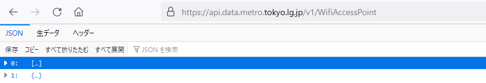
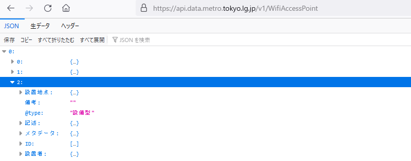
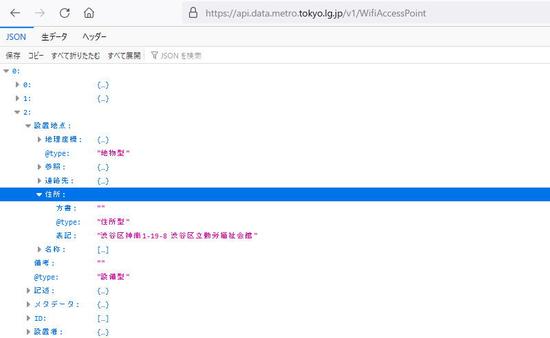

## jqによるJSON解析

以下、100個のWifiデータが含まれたJSONデータがファイル`wap1.json`に収容されているとします（つまり、`curl -s .... | jq ...`の代わりに`cat wap1.json | jq ...`と実行します）。

### 全体を表示

読みやすいように全体を整形して表示するには、`jq`に`.`を指定して実行します。`.`は「ここ」という意味です。ドメイン名やディレクトリ構造のように「トップレベル」や「ルート」と呼んでもよいでしょう。

```
$ cat wap1.json | jq '.'
[                                                        # 最も外側の配列
  [                                                      # その中の配列
    {                                                    # 配列要素はプロパティ
      "備考": "",
      "設置者": {                                         # プロパティ値がオブジェクトになっている
        "表記": "東京都",
        "@type": "組織型"
      },
      "@type": "設備型",
      "メタデータ": {
        "@type": "文書型",
        "発行者": {
        ︙
```

`jq`は指定の`.`を起点に入力JSONデータを階層に沿ってばらしながら表示します。入れ子になった構造は順次インデントされます。先頭の`[`は、このJSONデータ全体が配列であることを示しています（閉じ`]`はこのファイルの末尾にあります）。

ブラウザから見てみます。

<!--- 800 x 137 --->


ここから、全体をくくる`[]`に2つの要素があることがわかります。0番目は配列で、ここに100個のアクセスポイント情報が収容されています。1番目はオブジェクトで、「cursor」の箇所で見たように、このデータの情報（メタデータ）です。

### 1番目のメタデータ

1番目のオブジェクトを展開します。中身はプロパティ（キーと値）です。

<!--- 800 x 239 --->


同じことを`jq`でやります。まず、最も外側の配列の1番目の要素を`.[1]`から取得します。「ここ」の配列の1番目の要素と言う意味です。

```
$ cat wap1.json | jq '.[1]'
{
  "moreResults": "MORE_RESULTS_AFTER_LIMIT",
  "endCursor": "Cl8SWWoaYn50b2t5by1jYXRhbG9nLXByb2R1Y3Rpb25yOwsSCFJldmlzaW9uIhFXaWZpQ...",
  "revision": 3,
  "updated": "2021-05-21T08:32:13.505Z"
}
```

ここからカーソル位置の値（文字列）を得るには、さらにキー名の「endCursor」を加えます。`.`はディレクトリ構造で言えばパス区切り文字のように働きます。

```
$ cat wap1.json | jq '.[1].endCursor'
"Cl8SWWoaYn50b2t5by1jYXRhbG9nLXByb2R1Y3Rpb25yOwsSCFJldmlzaW9uIhFXaWZpQWNjZXNzUG9pbnQ6M..."
```

後続データがあるかを示す「moreResults」も同時に表示するには、カンマ`,`で併記します。

```
$ cat wap1.json | jq '.[1].endCursor, .[1].moreResults'
"Cl8SWWoaYn50b2t5by1jYXRhbG9nLXByb2R1Y3Rpb25yOwsSCFJldmlzaW9uIhFXaWZpQWNjZXNzUG9pbnQ6M..."
"MORE_RESULTS_AFTER_LIMIT"
```

`.[1]`を2回繰り返すのが面倒なら、1つにまとめることもできます。

```
$ cat wap1.json | jq '.[1] | .endCursor, .moreResults'
"Cl8SWWoaYn50b2t5by1jYXRhbG9nLXByb2R1Y3Rpb25yOwsSCFJldmlzaW9uIhFXaWZpQWNjZXNzUG9pbnQ6M..."
"MORE_RESULTS_AFTER_LIMIT"
```

`.[1]`を取得し、その結果をパイプ`|`で次の処理につないでいます。パイプはUnixのそれと同じで、前段の処理結果を次段の入力とします。パイプ左側の`.[1]`は、トップレベルの`.`を処理し、オブジェクトの中身を次段に引き渡します。パイプの右側では、個々の中身が「ここ」`.`となるので、オブジェクトのキーが`.moreResults`のように参照できます。


### おまけ：Base64

むやみと長い「endCursor」の文字列は、見たところ大文字小文字のアルファベットと数字だけからなり、末尾が`==`です。このような文字列はたいていBase64でエンコードされたデータです。そして、Base64ならデコードできます。もとデータがバイナリなら容易には読めませんが、文字列のところだけなら読めます。

残念ながら`jq`にはBase64エンコーダがないので、Pythonから試します。

```Python
>>> import base64
>>> base64.b64decode('Cl8SWWoaYn50b2t5by1jYXRhbG9nLXByb2R1Y3Rpb25yO...gAA==')
b'\n_\x12Yj\x1ab~tokyo-catalog-productionr;\x0b\x12\x08Revision"\x11WifiAccessPoint:3
\x0c\x0b\x12\x0fWifiAccessPoint\x18\x80\x80\x80\xcc\xaf\xc7\xc4\x08\x0c\x18\x00 \x00'
```

### 0番目の配列のサイズ

（デフォルトで`?limit=100`なので）0番目の配列には100個のデータが収容されているはずなので、確認します。配列の要素数は、その配列を`length`関数にパイプから入力することから得られます。

```
$ cat wap1.json | jq '.[0] | length'
100
```


### 0番目の配列の要素

2番目の要素から、Wifi情報の構造を調べます。以下、これを（便宜上）「レコード」と呼びます。まずはブラウザからです。

<!--- 800 x 314 --->


`jq`なら次の通りです。

```
$ cat wap1.json | jq '.[0][2]'
{
  "設置者": {
    "表記": "東京都",
    "@type": "組織型"
  },
  "メタデータ": {
    "@type": "文書型",
    "発行者": {
      "ID": {
        "@type": "ID型",
        "識別値": "130001"
      },
      "@type": "組織型",
      "住所": {
        "市区町村": "",
        "都道府県": "東京都",
        "@type": "住所型"
      }
    }
  },
  "ID": [                                                # 値は配列
    {                                                    # 0番目の要素
      "識別値": "704",
      "@type": "ID型"
    },
    {                                                    # 1番目の要素
      "種別": "SSID",
      "識別値": "FREE_Wi-Fi_and_TOKYO",
      "@type": "ID型"
    }
  ],  
 ︙
```

レコードは入れ子になったオブジェクトです。このオブジェクトから「ID」プロパティの0番目の要素の「識別子」プロパティの値（704）を得るには、次のようにします。

```
$ cat wap1.json | jq '.[0][2].ID[0]."識別値"'
"704"
```

「ID」はプロパティ名が英文字なのでそのまま書けますが、「識別値」はUnicodeなので二重引用符でくくらなければならないのがポイントです。あと、配列の配列のときは、間にドット`.`は入りません。

### 指定のIDのレコードを取得

これは、REST APIパラメータの「ID.識別値」が指し示すものです。REST APIと同じこと（この識別値を持つレコードのみを抽出）をするには、次のようにします。

```
$ cat wap1.json | jq '.[0][] | select(.ID[0]."識別値" == "704")'
{
  "設置者": {
    "表記": "東京都",
    "@type": "組織型"
  },
  "メタデータ": {
    "@type": "文書型",
    "発行者": {
      "ID": {
        "@type": "ID型",
        "識別値": "130001"
        ︙        
```

ちょっとややこしいです。まず、最初の`.[0]`がWifiデータの配列です。続く`[]`はイテレータで、配列をループをしながら要素を順に抜き出せという指示です。そして、`select`はSQLなら`where`句に相当するもので、要素の中で`.ID[0].識別値`が"704"のものだけを抜き出せと指示しています。


### キーを抜き出す

レコードのキー（プロパティ名）だけを抜き出したいのなら、`keys`関数を使います。この関数は、オブジェクトを受け取るとそのキーを要素とした配列を返します。

```
$ cat wap1.json | jq '.[0][2] | keys'
[
  "@type",
  "ID",
  "メタデータ",
  "備考",
  "記述",
  "設置地点",
  "設置者"
]
```

「ここ」（`.[0][2]`の指し示すオブジェクト）直下のキーだけで、それらの子のキーは抽出されません。


### 住所を抜き出す

レコードの「設置地点」プロパティの「住所」プロパティの「表記」プロパティには、そのWifiの所在が示されています。ブラウザから確認します。

<!--- 800 x 492 --->


2番目の要素から住所を抜き出します。入れ子が深いので、ドット`.`がいくつも連なります。

```
$ cat wap1.json | jq '.[0][2]."設置地点"."住所"."表記"'
"渋谷区神南1-19-8 渋谷区立勤労福祉会館"
```

すべての要素について行うなら、`[2]`であったところをイテレータの`[]`に置き換えます。

```
$ cat wap1.json | jq '.[0][]."設置地点"."住所"."表記"'
"東京都品川区東八潮1"
"東京都新宿区新宿5-7-20"
"渋谷区神南1-19-8 渋谷区立勤労福祉会館"
"東京都港区芝大門2-9-11"
︙
```

二重引用符のせいで、字面が重くていけません。取り除くには`-r`オプションを使います。

```
$ cat wap1.json | jq -r '.[0][]."設置地点"."住所"."表記"'
東京都品川区東八潮1
東京都新宿区新宿5-7-20
渋谷区神南1-19-8 渋谷区立勤労福祉会館
東京都港区芝大門2-9-11
︙
```


### 住所の形式を揃える

住所は「東京都」で始まるものもあれば、区や市から始まるものもあるようです。これではあとの処理が面倒なので、「東京都」があればそれを削除することで住所の形式を揃えます。

先頭文字が所定のものかを調べるには、`startswith`関数を使います。この関数は、入力文字列の先頭が引数と一致すれば、`true`を返します。

```
$ cat wap1.json | jq -r '.[0][]."設置地点"."住所"."表記" | startswith("東京都")'
true                                                     # 東京都品川区
true                                                     # 東京都新宿区
false                                                    # 渋谷区神南
true                                                     # 東京都港区
︙
```

`true`なら、先頭3文字を取り除きます。配列要素指定の`[]`を文字列に適用すると、部分文字列の抽出になります。コロン`:`を使って範囲指定をすることもできます。文字列の3文字目以降を抜き出すなら`[3:]`です。これは、Pythonなら「スライス」と呼ぶ操作です。

```
$ echo '"東京都新宿区新宿5-7-20"' | jq '.[3:]'
"新宿区新宿5-7-20"
```

「～なら～する」はお馴染みの`if-then`です。`startswith`が`true`を返したら`[3:]`で3文字以降を、`false`なら`.`でそのままを出力させます。

```
$ cat wap1.json | jq -r '.[0][]."設置地点"."住所"."表記" | if startswith("東京都") then .[3:] else . end'
品川区東八潮1
新宿区新宿5-7-20
渋谷区神南1-19-8 渋谷区立勤労福祉会館
︙
```

なお、`jq`の`if`文には癖があり、`if [条件] then [真のときの処理] else [偽のときの処理] end`と、必ず`else`を加えなければなりません。`else .`のように明示的に`.`の出力が必要なのはそのためです。


### 住所をソートする

登場順がばらばらだと一覧性が悪いので、`sort`関数からソートします。

しかし、この関数は配列要素を並び変えるものです。そして、上記の出力は構造化されていない文字列の羅列なので（その証拠に全体が`[]`でくくられていない）、そのままでは`sort`できません。そこで、この出力全体を`[]`でくくることで「配列化」します。

```
#        V 配列化開始                                                                     V 配列化終了
$ cat wap1.json |\
  jq -r '[ .[0][]."設置地点"."住所"."表記" | if startswith("東京都") then .[3:] else . end ]'
[
  "品川区東八潮1",
  "新宿区新宿5-7-20",
  "渋谷区神南1-19-8 渋谷区立勤労福祉会館",
  "港区芝大門2-9-11",
 ︙
  "新宿区西新宿1-14-9"
]
```

前後に`[]`があることから、これは配列だとわかります。では、ソートします。

```
$ cat wap1.json | \
  jq -r '[ .[0][]."設置地点"."住所"."表記" | if startswith("東京都") then .[3:] else . end ] | sort'
[
  "あきる野市二宮673-1",
  "三鷹市大沢6-4",
  "世田谷区桜丘3-9-23",
  "中央区京橋3-8-1",
  "中央区日本橋2-16",
  "中央区日本橋3-4",
  "中央区日本橋室町1-5-2",
  "中央区日本橋小網町19",
  "中央区日本橋本町1-7",
  "中央区明石町12-1",
  "中央区築地3-15-1",
  "中央区銀座3-15-10",
  "中央区銀座4-6",
  "中央区銀座5-15",
  "中央区銀座7-3-6",
  "北区赤羽西1-5",
  ︙
```

`sort`はUnicodeコード順なので、読みで考えるとソートされた感じがあまりしません。しかし、見ての通り同じ区なら連続して表示されるので、そのままよりはまとまりがよくなっています。
 

### おまけ：区市村にあるWifiの数

上記のデータから、各区、市、村に設置されたWifiの数をカウントすることもできます。長いので、次に示すように関数化しました（`jq`は関数定義もできるのです！）。

```
def district_count:
    [
        .[0][]."設置地点"."住所"."表記" |
        if startswith("東京都") then
            .[3:]
        else
            .
        end |
        split("[区市村]"; "g")[0]
    ] as $input |
    $input |
    unique |
    map(
        . as $element |
        $input | map(select(. == $element)) | length |
        {($element): .}
    ) |
    add;
```

ファイル（ここでは`utils.jq`）に収容した関数を呼び出すには、次のように`include`を使います。

```
$ cat ../wap1.json | jq 'include "utils"; district_count'
{
  "あきる野": 1,
  "三鷹": 1,
  "世田谷": 1,
  "中央": 12,
  "北": 1,
  "千代田": 8,
  "台東": 10,
  "品川": 2,
  "国分寺": 1,
  "墨田": 4,
  "大田": 3,
  "府中": 2,
  "文京": 1,
  "新宿": 14,
  "新島": 2,
  "東大和": 1,
  "武蔵野": 1,
  "江戸川": 1,
  "江東": 2,
  "渋谷": 10,
  "港": 9,
  "目黒": 2,
  "神津島": 1,
  "立川": 1,
  "練馬": 1,
  "荒川": 1,
  "豊島": 5,
  "足立": 1,
  "青ヶ島": 1
}
```

コードはややこしいので説明は割愛します。`jq`でもやや複雑な統計処理もできるという見本だと思ってください。[`utils.jq`](./Codes/utils.jq "CODE")はこのGithubページからダウンロードできます。


#### おまけ：WiFiスポットとの距離

レコードには、Wifiの位置座標も収容されています。1番目のレコードから示します。

```
$ cat wap1.json | jq '.[0][1]."設置地点"."地理座標"'
{
  "経度": "139.710121",
  "緯度": "35.693105",
  "@type": "座標型"
}
```

この情報があれば、ある地点からこのスポットまでの距離を知ることができます。2点の経度緯度の距離を計算する方法はいくつかありますが、ここではCasioの「[Ke!san](https://keisan.casio.jp/exec/system/1257670779 "LINK")」サイトの計算式を使います。

三角関数が含まれていますが、幸いにも、`jq`にはC言語の数学ライブラリの諸関数が用意されています。ただ、πの値は用意されていないので自力で用意します。

計算式を`jq`で実装した関数を次に示します。これも`utils.jq`に収容しました。

```
def distance:
    (3.14159265358979323846 / 180) as $to_radian |  # m_pi from math.h
    6378.137 as $radius |
    (.[0] | map(. * $to_radian)) as $rad1 |
    (.[1] | map(. * $to_radian)) as $rad2 |
    ($rad2[0] - $rad1[0]) as $delta |
    ($rad1[1] | sin) * ($rad2[1] | sin) + ($rad1[1] | cos) * ($rad2[1] | cos) * ($delta | cos) |
    acos * $radius;
```

試してみましょう。まずは、所在、経度、緯度だけを抽出します。

```
$ cat wap1.json | jq -c '.[0][]."設置地点" | [."住所"."表記", (."地理座標" | [."経度", ."緯度"]) ]'
["東京都品川区東八潮1",["139.76809","35.6251"]]
["東京都新宿区新宿5-7-20",["139.710121","35.693105"]]
︙
```

関数`distance`は2点の経度緯度の配列の配列を入力して受け取るように設計されています（つまり、`[[経度1, 緯度1], [経度2, 緯度2]]`）。ここでは三鷹駅（[139.5607125, 35.7027021]）からの距離を計算します。

```
$ cat ../wap1.json | jq -c 'include "utils"; .[0][]."設置地点" |
  [."住所"."表記", (."地理座標" | [ [139.5607125, 35.7027021], [(."経度" | tonumber), (."緯度" | tonumber)] ] | distance) ]'
["東京都品川区東八潮1",20.64937352525128]
["東京都新宿区新宿5-7-20",13.549175268102921]
["渋谷区神南1-19-8 渋谷区立勤労福祉会館",13.333286630609894]
["東京都港区芝大門2-9-11",18.1896475234567]
["東京都大田区西蒲田7-68",20.957194623127247]
︙
```

これも、`jq`でもこんなことができる見本だと思ってください。
