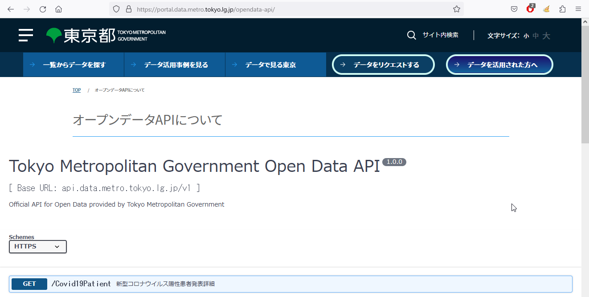

# オープンデータの活用～JSON＋`jq`パーザ

### 目的

本セミナーでは、[オープンデータ](https://ja.wikipedia.org/wiki/オープンデータ "LINK")へのアクセスとその処理を説明します。オープンデータの中身は多様で、アクセス方法やデータフォーマットやその解析方法もあれこれありますが、ここでは次のものを対象とします。

1. [REST APIによるアクセス](./01-Rest.md "INTERNAL")－REST（[Representational State Transfer](https://ja.wikipedia.org/wiki/Representational_State_Transfer "LINK")）は端的にはWeb/HTTPです。ブラウザからでもアクセスできますが、ここではコマンドラインから扱えるHTTPクライアントの[`curl`](https://curl.se/docs/manpage.html "LINK")を用います。
2. [JSONデータ](./02-Json.md "INTERNAL")－オープンデータのフォーマットにはCSVやExcelやPDFなどいろいろありますが、ここではJSONをターゲットにします。JSON（[JavaScript Object Notation](https://www.rfc-editor.org/rfc/rfc8259 "LINK")）はRESTでの要求・応答によく用いられる、可読テキストで表現されたデータ構造です。
3. [`jq`による処理](./03-Jq.md "INTERNAL")－[`jq`](https://stedolan.github.io/jq/manual/v1.6/ "LINK")はコマンドラインからJSONデータを処理する、（Unixで言うところの）`sed`や`awk`に似た文字列処理ツールです。単純なJSON整形ツールとして使われるケースが多いのですが、実は、それよりも多様な機能が用意されています。

本セミナーの目的は、`curl`や`jq`を使って、オープンデータの中身を手早くチェックする方法を学ぶところにあります。つまり、オープンデータを活用してアプリケーションを作成する一歩手前、既存のデータから何を造れるかを企画する段階で、考察の材料を集めるところです。


### ターゲット

オープンデータはいろいろありますが、ここでは東京都の[オープンデータAPIについて](https://portal.data.metro.tokyo.lg.jp/opendata-api/ "LINK")にある「公衆無線LANアクセスポイント一覧」を例題に用います。

```https://portal.data.metro.tokyo.lg.jp/opendata-api/```



`curl`でアクセスすると、こんな感じのデータが得られます。JSONデータが改行なしでずらずらと列挙されているので、中身がどんなものか、簡単には判別つきません。

```
$ curl -s https://api.data.metro.tokyo.lg.jp/v1/WifiAccessPoint
[[{"設置者":{"@type":"組織型","表記":"東京都"},"メタデータ":{"発行者":{"ID":{"識別値":"130001","@type":"ID型"},
"住所":{"@type":"住所型","都道府県":"東京都","市区町村":""},"@type":"組織型"},"@type":"文書型"},"備考":"",
"設置地点":{"住所":{"表記":"東京都千代田区内神田1丁目1" ...
```

`jq`を使えば、読みやすいようにフォーマットしてくれます。

```
$ curl -s https://api.data.metro.tokyo.lg.jp/v1/WifiAccessPoint | jq '.'
[
  [
    {
      "備考": "",
      "記述": {
        "@type": "記述型",
        "説明": "",
        "種別": "提供エリア"
      },
      "設置地点": {
        "住所": {
          "表記": "東京都品川区東八潮1",
          "方書": "",
          "@type": "住所型"
        },
       ︙
```

同様に、所定のデータを抜き出したり、整形したり、集計したりもできます。たとえば所在（上記の「設置地点 >住所 > 表記」の箇所）だけを抜き出せます。

```
$ curl -s https://api.data.metro.tokyo.lg.jp/v1/WifiAccessPoint | \
  jq '[ .[0][]."設置地点"."住所"."表記" | if startswith("東京都") then .[3:] else . end ] | sort | .[]'
"あきる野市二宮673-1"
"三鷹市大沢6-4"
"世田谷区桜丘3-9-23"
"中央区京橋3-8-1"
"中央区日本橋2-16"
︙
```


### 実習環境

Unixを想定しています。Windowsでは[Windows Subsystem for Linux](https://docs.microsoft.com/en-us/windows/wsl/ "LINK")の利用をお勧めします。

Windowsでも`curl`は問題なく利用できます。しかし、`jq`は特殊文字のエスケープがややこしく、直接コマンドプロンプトから実行するのは面倒です。そこで、直書きではなくファイル経由で実行することになります。


### インストール

`curl`はWindowsにもUnixにもたいてい付属していますが、なければ次のURLからZipファイルをダウンロードします。

[`https://curl.se/download.html`](https://curl.se/download.html "LINK")

`jq`のダウンロード先は次のURLです。バイナリ（LinuxならELF、Windowsならexe）がダウンロードされるので、そのまま使えます。

[`https://stedolan.github.io/jq/`](https://stedolan.github.io/jq/ "LINK")


使ってからインストールするかは考えるという方は、次のオンライン環境から試してください。

[`https://jqplay.org/`](https://jqplay.org/ "LINK")


### 受講対象者

オープンデータが使えないかと考えてはいるものの、始めあぐねている方。


### 参考書籍

- 豊沢聡: 『jqハンドブック NetOps/DevOps必携のJSONパーザ』, カットシステム（2021年7月）... 【
  [amazon.co.jp](https://www.amazon.co.jp/dp/4877834915 "LINK") |
  [honto](https://honto.jp/netstore/pd-book_31037910.html "LINK") |
  [Yodobashi](https://www.yodobashi.com/product/100000009003450000/ "LINK") 
】
- 豊沢聡：『jqクックブック』, カットシステム（近日発売）


