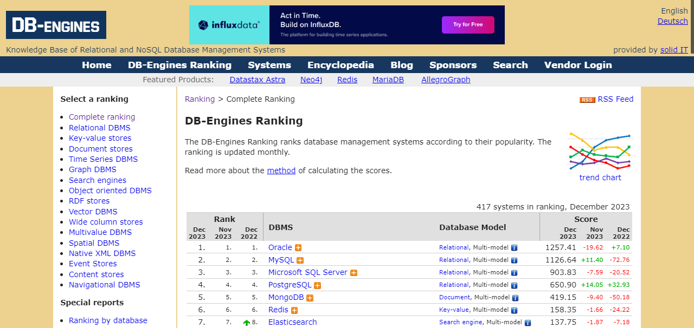
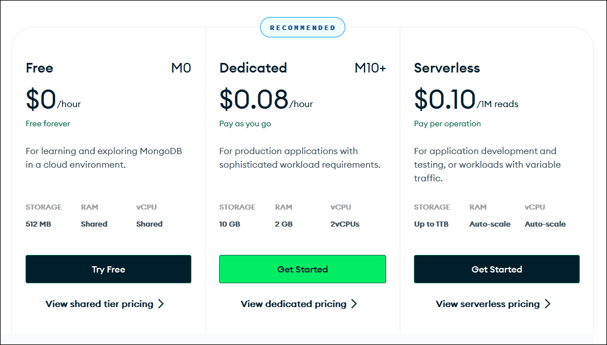

## 概要～NoSQLデータベース

### データベースの種類

大分類 | 小分類 | データベース例 | 特徴
---|---|---|---
リレーショナル | | Oracle | データを表構造に並べ、表の間に関係性（リレーション）を設ける。
NoSQL | ドキュメント型 | MongoDB | 構造を厳密に定めず、JSONなどの汎用的な方法でデータを表現する。
`"` | キー／値型 | Redis | キー＝値の組だけを収容する。シンプルな反面、非常に高速。
`"` | ワイドコラム型 | Cassandra | リレーショナルに似ているが、列（コラム）を事前に規定しなくてよく、しかも非常に多くの列を構成できる。
`"` | グラフ型 | Neo4j | グラフ構造でデータを表現する。

データベースはリレーショナル型（Relational Database Management System）とそれ以外に分けられます。前者はデータの操作に`SELECT * FROM table WHERE type="relational";`のようなSQL言語を用いるのに対し、後者はSQLを使わないのでNoSQLと呼ばれます（総称であって、NoSQLという言語やシステムがあるわけでない）。

NoSQLにはいろいろバリエーションがありますが、収容するデータの構造から上記の表のようにおおまかに4タイプに分類されます。


### MongoDB

本セミナーで紹介するMongoDBはデータをJSON形式（正確にはそのバイナリ版のBinary JSON）で収容する「ドキュメント型」のデータベースです。

MongoDBはNoSQLの中でもトップクラスの人気を誇っています。データベースの人気ランキングは次にURLを示す[DB-Engines](https://db-engines.com/en/ranking "LINK")から確認できます。




### MongoDB Atlas

MongoDBには、一般のデータベースサーバ同様にホストシステムにインストールして運用するタイプのものと、オンラインで使えるクラスタタイプのものがあります。ここで紹介するのは後者のクラスタタイプで、[MongoDB Atlas](https://www.mongodb.com/ja-jp/atlas/database "LINK")と呼ばれています。使い勝手はどちらも同じです。

MongoDB Atlasには有償版もありますが、無償のお試し版もあります。ストレージサイズが小さく、システムリソースが共有なのでシリアスな目的には向きませんが、たいていのカジュアルな用途にはこれで十分です。



[オンラインマニュアル](https://www.mongodb.com/docs/ "LINK")は`https://www.mongodb.com/docs/`にあります。


### MongoDBのデータ構造

MongoDBの「ドキュメント」はJSON形式で記述されます。リレーショナルデータベースのレコードが必ず同じ形の列で構成さなければならないのと異なり、ドキュメントには不揃いなフィールド（プロパティ）があってもかまいません。JSONオブジェクトや配列はネストすることもできます。コレクションは、不定形なJSONオブジェクトの配列と考えることができます。

MongoDBには、リレーショナル型データベース同様に複数のデータベースを収容できます。そして、データベースには複数の「コレクション」を収容できます。これはリレーショナル型では「テーブル」（表）に、Excelのようなスプレッドシートアプリケーションでは「シート」に相当します。

コレクションには複数の「ドキュメント」が収容できます。これテーブル上の各レコード(行）に相当します。端的には、ドキュメントは次のようなJSONオブジェクトです。

```json
{
  "name": "磯自慢",
  "company": "磯自慢酒造",
  "location": "静岡県焼津市",
  "url": "http://www.isojiman-sake.jp/"
}
```

テーブルコラム（表の列）はフィールドと呼ばれます。リレーショナル型では列はまんべんなく埋まっていなければなりませんが（該当する値がなければ`NULL`を使う）、MongoDBではそれが許されています。

データベースの構造を示す用語を次の表に示します。

リレーショナル | MongoDB | スプレッドシート
---|---|---
データベース | データベース | ファイル
テーブル（表） | コレクション | シート（タブ）
レコード（行） | ドキュメント（JSONテキスト） | 行
コラム（列） | （JSONオブジェクトの）フィールド | 列


ドキュメントを挿入すると、MongoDBはそれぞれのドキュメントに一意な`_id`という名のフィールドを自動的に挿入します。`_id`フィールドはリレーショナルデータべースのプライマリキーのような役割を果たします。


### JSON

JSONには次のデータ型があります（というか、これだけですべてを記述します）。

- 数値
- 文字列
- 真偽値（`true`または`false`）
- `null`
- 配列（要素はどのデータ型でもよい）
- オブジェクト

JSONについて細かいことを確認したくなったら、公式の仕様である[RFC 8259 "The JavaScript Object Notation (JSON) Data Interchange Format"](https://www.rfc-editor.org/info/rfc8259 "LINK")を参照します。
