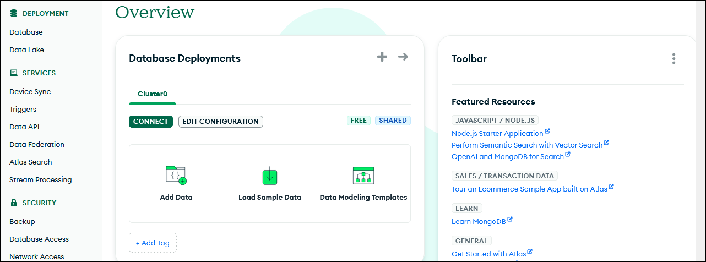
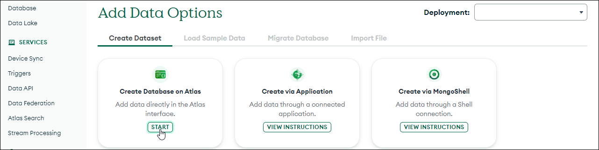
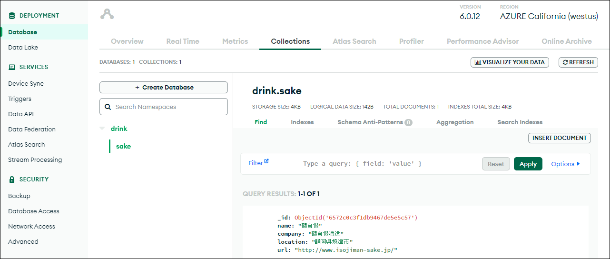

## MongoDB Atlas Web インタフェース

データベースは［組織］>［プロジェクト（デフォルトProject 0）］> ［データベース］>［コレクション］>の階層で管理されています。


### ログイン・ログアウト

MongoDB Atlasの[ログインページ](https://account.mongodb.com/ "LINK")からログインします。ログインすると「Overview」ページが表示されます。



ログオフするには、画面右上にあるユーザ名のプルダウンメニューから「Log out」を選択します。


### データベースの作成

［Add Data］ボタンをクリックすると、「Add Data Options」（データオプションの設定）ページに遷移します。



選択肢が3つありますが、左端の「Create Database on Atlas」の［Start］ボタンをクリックすることで、次の「Add Data Options」ページに遷移します。


データベース（コレクションの集合）とコレクション（ここで作成するテーブル）の名前をセットします。

コレクションの構造を指定するスイッチボタンが2つありますが、どちらもオフにします。「Capped collection」はサイズ上限を設けたコレクションで、上限以上のデータを挿入すると循環式バッファのように古いものから削除されます。「Time series collection」はドキュメントに必ず時刻情報が加わるものです。販売記録や株価のようなデータに向きます。

その下のフィールドは、コレクションに挿入するドキュメントです。JSONオブジェクトを1つ（1レコードぶん）を書き込みます。ここでは、次のデータを投入します。

```json
{
  "name": "磯自慢",
  "company": "磯自慢酒造",
  "location": "静岡県焼津市",
  "url": "http://www.isojiman-sake.jp/"
}
```

用意ができたら［Create Database］ボタンをクリックします。

<!-- Chrome は文法チェックはしてくれない。Firefox はやってくれるが、これはプラグインか? -->
JSONテキストが正しく書かれていないと「Insert not permitted while document contains errors」（テキストにエラーがあるので挿入できません）とエラーが上がります。

完了すると、画面がデータベースビューに遷移します。タブが［Collections］になっており、今作成したdrinkデータベースに、sakeコレクションが作成され、その中のドキュメントが1つ表示されています。



ドキュメントには、挿入時にはなかった`_id`フィールドが加わっています。これは、MongoDBが付けるオブジェクトIDで、リレーショナルデータベースでいうところのプライマリキーのように、一意にドキュメントを指し示すためのものです（12バイト長の16進数文字列24個です）。


### ドキュメントの挿入

ドキュメント（JSONオブジェクト）を挿入するなら（SQLの`INSERT`に相当）、上記の画面右にある［INSERT DOCUMENT］をクリックします。ドキュメント挿入のダイアログボックスが現れます。


右にある「View」から、オブジェクト形式`{}`とフラットなキー・値形式`≡`が選べるようになっています。使いやすいほうを選んでください。ここではオブジェクト形式にして挿入しています。用意ができたら［Insesrt］ボタンをクリックします。

挿入されるともとの画面に戻り、今度は2つのドキュメントが表示されます。

データベース作成時に挿入したドキュメントと今挿入したものとで、オブジェクトの構造が揃っていないところがポイントです。MongoDBのコレクションには、異なる格好のオブジェクトを収納できるのです。


### ドキュメントの検索（filter）

特定のドキュメントを検索するなら（`SELECT`に相当）、画面右中央にある「Filter」を使います。検索語（`WHERE`に相当）は例に示されているように、オブジェクト形式で指定します。たとえば、`name = '開運'`を検索するのであれば、`{"name": "開運"}`を入力します。


### ドキュメントの更新と削除

ドキュメントのフィールドを更新あるいは削除するなら、そのドキュメントをホバーすれば、右にアイコンメニューが出てきます。


アイコンは左から「編集✎」（`UPDATE`に相当）、「コピー🗐」、「複製⧉」、「削除🗑」（`DELETE`に相当）です。


### 命名上の注意

データベース、コレクション、フィールドの命名にはいくつか制約があります。

データベース名の制約を次に示します。データベースサーバを運用しているOSの違いなどで制約が異なるものもありますが、ここではより厳しいパターンを掲載します。

- 大文字小文字の違いは無視します。たとえば、`drink`と`Drink`は同じものとして扱われます。
- 次の特殊記号を含めません：`/\. "$*<>:|?`および`null`。
- 最大長は64文字です。

コレクション名の制約を次に示します。

- 先頭文字はアンダースコア`_`または文字のみが使用可能です。
- 最大長は235バイトです。これは、データベース名と`.`で連結したときの全長です。
<!-- 複数形の小文字の仕様が推奨されます。これは、Mongooseの`Model`クラスが、モデル名を複数形、小文字化したコレクションを探すからです。 -->
<!-- See https://mongoosejs.com/docs/models.html -->

フィールド名の制約を次に示します。

- `_id`は予約語（ドキュメントのプライマリキー）なので使えません。
- 文字`$`および`.`は含んではいけません（この制約は緩和されてはいますが、避けるべきです）。
- 重複は認められません。たとえば、`{"name": "志太泉", "name: "磯自慢"}`のようなケースです（JSONそのものの仕様違反ではありませんが、実装依存とされています）。

正確なところは、次のURLに示すMongoDBマニュアルの「Reference > MongoDB Limits and Threshoold > Naming Restriction」欄を参照してください。

<!-- ["LINK", "EN", "MongoDB Manual > Reference MongoDB Limits and Thresholds", "", "MongoDBの各種制約条件。データベース、コレクション、フィールドなどの名称に用いることのできる文字についてはNaming Restrictions」項を参照してください。"] -->
```https://www.mongodb.com/docs/manual/reference/limits/```

