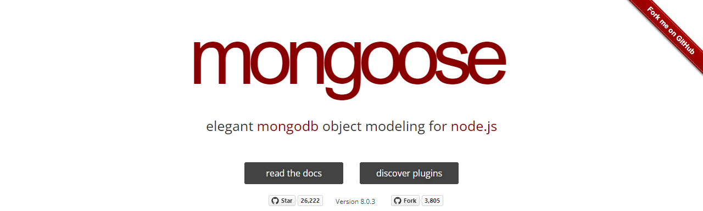

## Mongose - Node.js用MongoDBライブラリ

### Mongoose

[Mongoose](https://mongoosejs.com/ "LINK")はMongoDB操作のライブラリパッケージです。




### データベースの利用

MongoDBに接続し、いくつか操作をし、切断をするサンプルコートを次に示します。コード[`mg-connect.js`](./Codes/mg-connect.js "CODE")は本リポジトリに収容されています。

```javascript
[File] mg-connect.js
  1  const fs = require('node:fs');
  2  const mongoose = require('mongoose');
  3  mongoose.pluralize(null);
  4
  5
  6  async function connect(url, options) {
  7    // データベース接続
  8    await mongoose.connect(url, options);
  9    console.log('Connected.');
 10
 11    // スキーマの設定
 12    let schema = mongoose.Schema({
 13      name: String,
 14      company: String,
 15      location: String,
 16      url: String,
 17      phone: String
 18    });
 19    let Sake = mongoose.model('sake', schema);
 20
 21    // Find (=select)
 22    let results = await Sake.find({}).exec();
 23   console.log('Find: ', results);
 24
 25    // 切断
 26    await mongoose.disconnect();
 27    console.log('disconnected.');
 28  }
 29
 30
 31  if (require.main === module) {
 32    let credential = JSON.parse(fs.readFileSync(process.argv[2], {encoding: 'utf-8'}));
 33    connect(credential.url, credential.options);
 34  }
```


### MongoDBのメソッド

MongoDBのメソッドは大半がPromiseを返す非同期関数です。

ここでは`async function`でくるんで`await`で同期的に（シーケンシャルに処理しています）。


### アカウント情報の読み取り

MongoDBへのアクセスURL、ユーザ名、パスワード、そしてアクセスするデータベース名は、実行時の引数で指定するファイルに収容されているとします（さすがにパスワードをハードコートするのは問題があるので）。

ファイルは次のようにJSONで記述されています。

```json
{
  "options": {
    "user": "ユーザ名",
    "pass": "パスワード",
    "dbName": "データベース名"
  },
  "url": "MongoDB AtlasへのURL"
}
```

データベースの接続する`mongoose.connect()`（8行目）は第1引数にURLを、第2引数にオプションを取ります。上記の`url`および`options`プロパティはこれらに直接代入されます。


### スキーマとモデル

Mongooseは、MongoDBデータベースのコレクションにアクセスするに際し、そのデータ構造をあらかじめ厳密に定めます。これをスキーマ（schema）といいます。

たとえば、次のようなオブジェクトで構成されたドキュメントからなるコレクションがあるとします。

```json
{
  "name": "磯自慢",
  "company": "磯自慢酒造",
  "location": "静岡県焼津市",
  "url": "http://www.isojiman-sake.jp/",
  "phone": "054-628-2204"
}
```

この構造を反映したスキーマは、`mongoose.Schema()`コンストラクタから16～22行目の要領で作成します。

コンストラクタの第1引数に指定するオブジェクトのプロパティキーはドキュメントと同じです。値は、そのキーに収容される値のデータ型を示します。データ型には次のものが定義されていますが、よく使うのは`String`（文字列）、`Number`（数値）、`Boolean`（真偽値）でしょう。型の定義はJavaScriptと同じです。入れ子になったデータ構造では`Array`（配列）や`Map`（JavaScriptの構造型）も使います。データ型の詳細は「[Mongoose Guides: SchemaTypes](https://mongoosejs.com/docs/schematypes.html "LINK")から調べられます。

スキーマを作成したら、そこから`mongoose..mode()`からモデル（model）を作成します（23行目）。

Mongooseはこのモデルを介してデータベースと相互作用します。これにより、データを挿入する前にデータを検証することなどができます。


### コレクション名の複数化抑制

Mongooseは、モデル名からアクセス先のコレクション名を自動的に生成します。このとき、Mongooseはコレクション名を小文字化し、複数化します。たとえば、モデル名が`sake`なら、アクセス先のコレクション名は`sakes`です。

この挙動は、複数のドキュメントを含んたコレクションの名称に複数形を使いたくなる英語話者にはありがたいのかもしれませんが、わたしたちには中学英語の試験を受けているような気分にさせられます。モデル名mouseのコレクション名がmiceになるとか、sheepのコレクション名はやはりsheepとか、あまり悩みたくありません。しかも、複数化処理はさほど賢くなく、Tokyoを指定すると（たぶん、このコレクションには区や市のドキュメントが含まれている）、Tokyo**s**にしてくれます。

モデル作成時の複数化を抑制するには、冒頭で`mongoose.plurize()`メソッドから複数形化を無効化します（3行目）。


### ドキュメントの検索

ドキュメントをコレクションから検索するには`Model.find()`メソッドを使います。このメソッドは`Query`オブジェクトを返すので、その`exec()`メソッドで検索を実行します（22行目）。


### コネクションの切断

データベースサーバとの接続を切断するには、`mongoose.disconnect()`です（26行目）。
