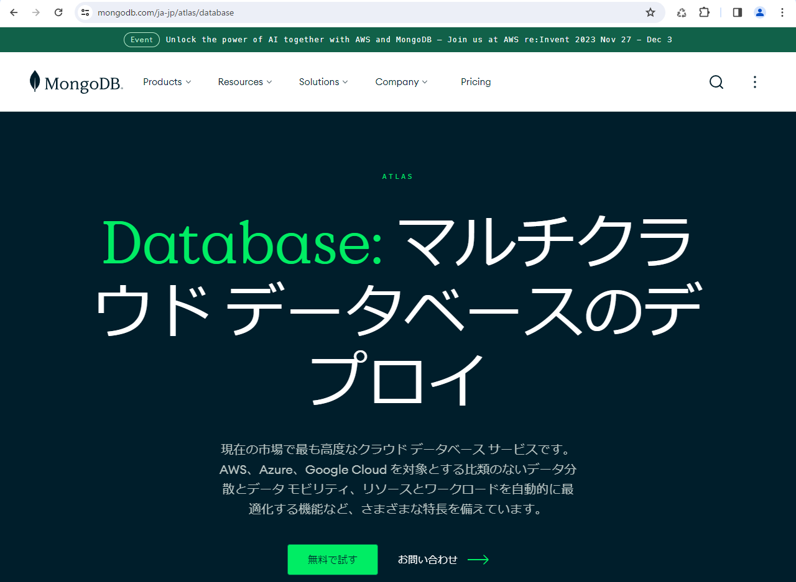

# NoSQLデータベース入門～MongoDB Atlas＋Node.js/Mongoose

### 目的

本セミナーでは[NoSQL](https://ja.wikipedia.org/wiki/NoSQL "LINK")、その中でもJSONデータに特化したMongoDBの利用方法を説明します。

MongoDBのオンライン版（クラウドサービス）はアカウントを登録するだけで即座に利用できます。クレジットカードの提示も必要ありません。

### プログラム

セミナーの時間は90分です。

1. [概要～NoSQLデータベース](./01-Introduction.md "INTERNAL")
2. [MongoDB Atlas～アカウントの作成](./02-Account.md "INTERNAL")
3. [MongoDB Atlas～Webインタフェースでの操作](./03-Web.md "INTERNAL")
4. [JavaScriptプログラミングによるアクセス～インストール](./04-Install.md "ITNERNAL")
5. [JavaScriptプログラミングによるアクセス～Mongoose](./05-Mongoose.md "ITNERNAL")

### 環境

- プログラミング言語: [JavaScript](https://developer.mozilla.org/ja/docs/Web/JavaScript "LINK")
- 言語インタプリタ（実行環境）: [Node.js](https://nodejs.org/en "LINK")
- 使用する外部ライブラリ（NPMモジュール）: [Mongoose](https://mongoosejs.com/ "LINK")

オンラインNode.jsもありますが、`Mongoose`がインストールされていて無登録で利用できる簡便な環境はないようです。登録して利用する環境には[repl.it](https://replit.com/languages/nodejs "LINK")や[w3schools](https://www.w3schools.com/nodejs/nodejs_compiler.asp "LINK")などがあります。

### 受講の条件

1～3には履修条件はありません。

4～5では、JavaScriptプログラミングの初級レベルの経験が必要です。

### 参照テキスト

- 『詳説 Node.js API リファレンスと用例』（2020）...【
	[出版社](https://www.cutt.co.jp/book/978-4-87783-489-0.html "LINK")
	[Amazon.co.jp](https://www.amazon.co.jp/dp/4877834893 "LINK")
	[ヨドバシ](https://www.yodobashi.com/product/100000009003304685/ "LINK")
	[Honto](https://honto.jp/netstore/pd-book_30361360.html "LINK")】 

