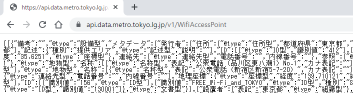
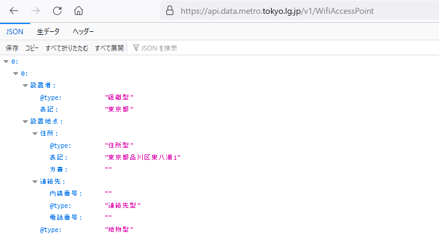
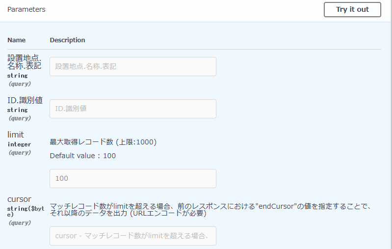
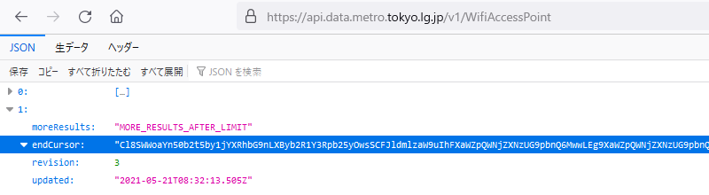

## RESTアクセス

### アクセス先

「Base URL」である`api.data.metro.tokyo.lg.jp/v1`に、「GET」以下のパスを加えることで、個々のデータにアクセスできます。「公衆無線LANアクセスポイント一覧」なら`https://api.data.metro.tokyo.lg.jp/v1/WifiAccessPoint`です。

REST APIも通信機能的にはWebと同じただのHTTPなので、とくに追加要求がなければ、ブラウザから普通にアクセスできます。ただ、応答がHTMLではなくJSON形式なので、レンダリング（整形）されずに生のまま表示されます。次の例は生のままのChromeの画面です。

<!--- 691 x 206 --->


アドオンや拡張を入れる、あるいは設定を変更すれば、整形してくれます。次の例はFirefoxの画面です（`about:config`から`devtools.jsonview.enabled`を`true`に変更する）。

<!--- 729 x 391 --->



### `curl`でアクセス

コマンドラインからHTTPアクセスのできる`curl`でも同じことができます。コマンド名に続いてURLを指定するだけです。

```
$ curl https://api.data.metro.tokyo.lg.jp/v1/WifiAccessPoint
  % Total    % Received % Xferd  Average Speed   Time    Time     Time  Current
                                 Dload  Upload   Total   Spent    Left  Speed
100 97128  100 97128    0     0  49153      0  0:00:01  0:00:01 --:--:-- 49128
[[{"ID":[{"@type":"ID型","識別値":"412"},{"種別":"SSID","識別値": ...
```

わざわざコマンドプロンプト（コンソール）から実行するのは、受信したJSONデータをパイプ経由で`jq`につないでその場で処理ができるからです。また、オープンデータサイトによっては要求される特殊なHTTP要求なども、ブラウザより簡単に指定できます。


### プログレスメータが邪魔

`% Total`から3行は、`curl`が標準エラー出力（`stderr`）に書き出すプログレスメータです。標準出力（`stdout`）には影響しませんが、見た目に邪魔です。これを除くには、`-s`オプションを使います。

```
$ curl -s https://api.data.metro.tokyo.lg.jp/v1/WifiAccessPoint
[[{"ID":[{"@type":"ID型","識別値":"412"},{"種別":"SSID","識別値": ...
```


### ファイルへ書き出し

応答をファイルに書き出せば、異なる処理をするたびにインターネットアクセスしなくても済みます。どのような処理をしたいか決まっていないときはいったんファイルに収容し、そこからいろいろ試したほうが、ネットワークにも相手サイトにも優しいです。

```
$ curl -s https://api.data.metro.tokyo.lg.jp/v1/WifiAccessPoint > file
$ more file
[[{"ID":[{"@type":"ID型","識別値":"412"},{"種別":"SSID","識別値": ...
```


### パラメータ指定

REST APIでは、データ提供元（サーバ）が用意したパラメータ（あるいはHTTP要求ヘッダ）を用いることで、要求内容を変更することができます。提供元には利用方法がたいていは示してあります（が、どこでもあまり親切とは言えません）。次に示すのは東京都の公衆無線LANのものです。

<!--- 799 x 507 --->


左の「Name」とあるのはクエリ文字列の変数名です。クエリ文字列は、URL末尾に`?`を挟んで「変数名`=`値」の形で加えます。値は検索対象です。

#### 設置地点.名称.表記

このパラメータは、Wifi情報をその所在から検索するときに用います。次の例では「公衆電話（新宿区新宿5-7-20）」を検索しています。

```
$ curl https://api.data.metro.tokyo.lg.jp/v1/WifiAccessPoint?設置地点.名称.表記=公衆電話（新宿区新宿5-7-20）
[[{"ID":[{"@type":"ID型","識別値":"156"},{"@type":"ID型","識別値":"FREE_Wi-Fi_and_TOKYO",...
```

実行してみるとわかるように、所在のリストではなく、1か所のものだけを応答します。

「ID.識別値」も同様で、Wifi情報をIDから検索します。

これらパラメータ名は、JSONデータの構造から来ています。構造がわからないと意味不明ですが、これは次章で説明します。

#### limit

「limit」は1回の要求で応答してほしい要素（アクセスポイントの情報）の数です。画面に示されているように、デフォルトでは100です。次の例では2個に限定しています。

```
$ curl https://api.data.metro.tokyo.lg.jp/v1/WifiAccessPoint?limit=2
[[{"メタデータ":{"@type":"文書型","発行者":{"@type":"組織型","ID":{"識別値":"...
```

実行してみるとわかるように、応答が前のものの2倍くらいになっています。

#### cursor

このAPIは1回のアクセスで100個のWifi情報を応答してくれますが、実際にはもっとたくさんのWifiが登録されています。続きを読むときは、この「cursor」パラメータから続きの位置を指定します。

cursor情報は応答そのものに含まれています。Webブラウザから示します。

<!--- 800 x 239 --->


「moreResults」プロパティは、続く情報の有無を示します。ここから、続きがあることがわかります。

「endCursor」はこの応答の末尾を示します。この文字列を値としてクエリ文字列を構成すれば、続きが読めます。

続きかどうかを確認するため、JSONデータの中からWifiの識別ID番号を抽出して示します（`jq`の中身はあとで説明するので、気にしないでください）。

まずは1回目です。

```
$ curl -s https://api.data.metro.tokyo.lg.jp/v1/WifiAccessPoint | \
  jq -c '.[1].endCursor, ([ .[0][].ID[0]."識別値" ] | map(tonumber) | sort)'
"Cl8SWWoaYn50b2t5by1jYXRhbG9nLXByb2R1Y3Rpb25yOwsSCFJldmlzaW9uIhFXaWZpQWNjZXNzUG9pbnQ6MwwLEg9XaWZpQWNjZXNzUG9pbnQYgICAzK/HxAgMGAAgAA=="
[4,12,20,28,32,36,44,52,60,68,76,84,92,100,108,116,124,132,140,148,156,160,164,172,180,188,196,204,
212,220,228,236,244,252,260,268,276,284,288,292,300,308,316,324,332,340,348,356,364,372,380,388,396,
404,412,416,420,428,436,444,452,460,468,476,480,484,492,500,504,512,516,520,528,536,544,552,560,568,
576,580,584,592,600,608,616,624,632,640,648,656,664,672,680,688,696,704,708,712,720,728]
```

続いては、これに続く100個のデータを取得します。

```
$ curl -s https://api.data.metro.tokyo.lg.jp/v1/WifiAccessPoint?cursor=Cl8SWWoaYn50b2t5by1jYXRhbG9nLXByb2R1Y3Rpb25yOwsSCFJldmlzaW9uIhFXaWZpQWNjZXNzUG9pbnQ6MwwLEg9XaWZpQWNjZXNzUG9pbnQYgICAzK/HxAgMGAAgAA== | \
 jq -c '.[1].endCursor, ([ .[0][].ID[0]."識別値" ] | map(tonumber) | sort)'
"Cl8SWWoaYn50b2t5by1jYXRhbG9nLXByb2R1Y3Rpb25yOwsSCFJldmlzaW9uIhFXaWZpQWNjZXNzUG9pbnQ6MwwLEg9XaWZpQWNjZXNzUG9pbnQYgICA9LbFiwkMGAAgAA=="
[8,16,24,30,40,48,56,62,64,72,80,88,94,96,104,112,120,128,136,144,152,158,168,176,184,190,192,200,
208,216,222,224,232,240,248,256,264,272,280,286,296,304,312,318,320,328,336,344,350,352,360,368,
376,384,392,400,408,414,424,432,440,446,448,456,464,472,478,488,496,508,514,524,532,540,548,556,564,
572,578,588,596,604,610,612,620,628,636,642,644,652,660,668,676,684,692,700,706,716,724,732]
```

見ての通り、最初のものは4からスタートして8つおき、次のものは８からスタートして同じく8つおきのデータが得られています（ということは8回繰り返せば全部取得できそうです）。
