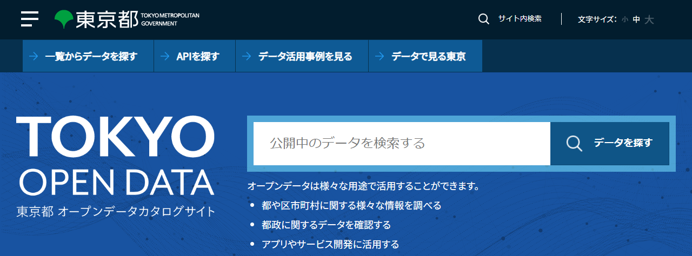

## 東京都 オープンデータカタログサイト

[東京都 オープンデータカタログサイト](https://portal.data.metro.tokyo.lg.jp/)のトップページはこちらです。

```https://portal.data.metro.tokyo.lg.jp/```

<!-- 1280x474 -->


トップメニューの［一覧からデータを探す］をクリックすれば、現在収容されているデータセットが表示されます。左パネルの［フォーマット］から「GeoJSON」でフィルタリングすれば、41件のデータセットが見られます（2024年8月現在）。演示では次の3つのデータセットを使います（お試し版では`Point`のみ）。

- `Point`: [港区の公共施設情報（港区） > 区役所・総合支所](https://catalog.data.metro.tokyo.lg.jp/dataset/t131032d0000000014) ... 7個所。
- `LineString`: [避難道路（品川区）](https://catalog.data.metro.tokyo.lg.jp/dataset/t131091d0000000139)（品川区）... 2線。
- `Polygon`: [地区内残留地区（品川区）](https://catalog.data.metro.tokyo.lg.jp/dataset/t131091d0000000135)（品川区）... 6区域。

> [「地区内残留地区」](https://www.city.shinagawa.tokyo.jp/PC/bosai/bosai2/jishin/hpg000019726.html)とは、「震災時における市街地大火の危険性が少ないことから、避難の必要がないとみなされた地区」らしいです。

リンクをたどれば、ブラウザ上にGeoJSONデータが表示されます。ブラウザによっては、整形して示してくれます（e.g., Firefox）。整形機能がなければ、外部のプラグインを導入してください。

>  オープンデータの品質は保証されていません。リンク先が消失するのはもちろん、HTTPのメディアタイプが不明であったり、拡張子があっていなかったり、文字コード指定が嘘だったりすることはしばしばあります。

[`jq`](https://jqlang.github.io/jq/)という、コマンドラインでJSONを整形・表示するツールも便利です。[`curl`](https://curl.se/docs/manpage.html)と組み合わせることで、コマンドラインだけでちゃくっとデータの中身を確認できます。

```bash
$ URL=https://opendata.city.minato.tokyo.jp/dataset/74c06ebb-47dd-4fe1-8ba7-a5be60d2a448/resource/f1a1056b-a00e-4c12-8a78-288e0eee7ba0/download/minatokushisetsujoho_kuyakusyo.json
$ curl -s $URL | jq -r '.features[] | .geometry.coordinates + [.properties."タイトル"] | join(", ")'
139.75163, 35.658203, 0, 港区役所
139.751576, 35.658185, 0, 芝地区総合支所
139.735091, 35.660657, 0, 麻布地区総合支所
139.731725, 35.674775, 0, 赤坂地区総合支所
139.734045, 35.642076, 0, 高輪地区総合支所
139.751501, 35.646408, 0, 芝浦港南地区総合支所
139.777312, 35.629723, 0, 芝浦港南地区総合支所台場分室
```

興味のある方はこちらをどうぞ：「[jqハンドブック](https://www.cutt.co.jp/book/978-4-87783-491-3.html)」（2021年7月、カットシステム）。

