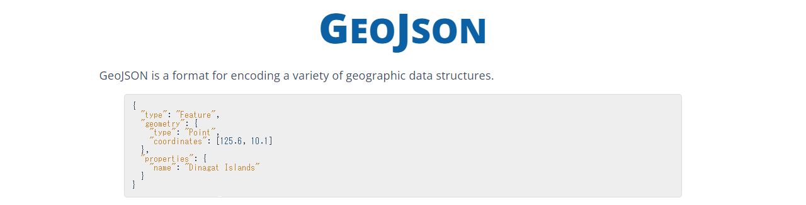

## GeoJSON

GeoJSONは非公式のワーキンググループが開発、管理している地理情報のJSON表現です（グループは公式でなくとも、仕様のRFC 7946は公式です）。サイトもあるにはありますが、たいした情報は出ていません。

<!-- 1280x327 -->


仕様のおおまかなところは、[Wikipediaの記事](https://ja.wikipedia.org/wiki/GeoJSON)でわかります。と言うか、データを利用するだけなら細かいことは気にしなくてもかまいません。位置（緯度経度）は、`features`配列要素の`geometry`プロパティの`coordinates`属性に収容されていることだけわかっていれば大丈夫です。

```json
{
  "type": "FeatureCollection",
  "features": [                                     # 配列。ここに複数の位置情報が収容されている。
    {
      "type": "Feature",
      "geometry": {                                 # 位置情報
        "type": "Point",                            # この情報の示す位置の形状
        "coordinates": [
          "139.75163",                              # 経度
          "35.658203",                              # 緯度
          0                                         # 高度（ないこともある）
        ]
      },
      "properties": {
        "タイトル": "港区役所",
        "分類": "区役所",
        "地区": "芝地区",
        "所在地": "港区芝公園一丁目5番25号",
        "連絡先": "電話：03-3578-2111（代表） ファックス：03-3578-2034",
        "URL": "<a href='https://www.city.minato.tokyo.jp/ ... 中略 ... /01.html</a>"
      }
    },
    ...
  ]
}
```

> さすがは日本の官公庁。まだ、ファックスあるんですね...

位置情報のタイプ（形状）には、点を示す`Point`、点の集合からなる`LineString`、これを閉区間にした`Polygon`があります（後述）。

> 他にも`MultiPoint`、`MultiLineString`、`MultiPolygon`のタイプがあります。詳細はRFCを参照してください。

GeoJSONのおおもとであるJSON（JavaScript Object Notation）ですが、Pythonから利用するときは次の対応関係を把握していればおおむね問題はありません。

<table border="0">
 <tr><th colspan="2">JSON</th> <th colspan="2">Python</th></tr>
 <tr><th>型</th><th>例</th><th>型</th><th>例</th></tr>
 <tr><td><tt>null</tt></td><td><tt>null</tt></td><td><tt>None</tt></td><td><tt>None</tt></td></tr>
 <tr><td>真偽値</td><td><tt>true、false</tt></td><td><tt>bool</tt></td><td><tt>True、False</tt></td></tr>
 <tr><td>数値</td><td>400、3.14、6.67e-11</td><td><tt>float</tt></td><td>400、3.14、6.67e-11</td></tr>
 <tr><td>文字列</td><td>"牛めし"</td><td><tt>str</tt></td><td>'牛めし'</td></tr>
 <tr><td>配列</td><td>["ごはん", "牛肉", "玉ねぎ"]</td><td><tt>list</tt></td><td>['ごはん', '牛肉', '玉ねぎ']</td></tr>
 <tr><td>オブジェクト</td><td>{"name": "牛めし"}</td><td><tt>dict</tt></td><td>{'name': '牛めし'}</td></tr>
</table>

JSONテキストとPythonオブジェクトの相互変換には、標準ライブラリの[`json`](https://docs.python.org/ja/3/library/json.html)を使います。

仕様はRFCで定義されています。

- [RFC 7158: The JavaScript Object Notation (JSON) Data Interchange Format](https://www.rfc-editor.org/info/rfc7158)
- [RFC 7946: The GeoJSON Format](https://www.rfc-editor.org/info/rfc7946)
