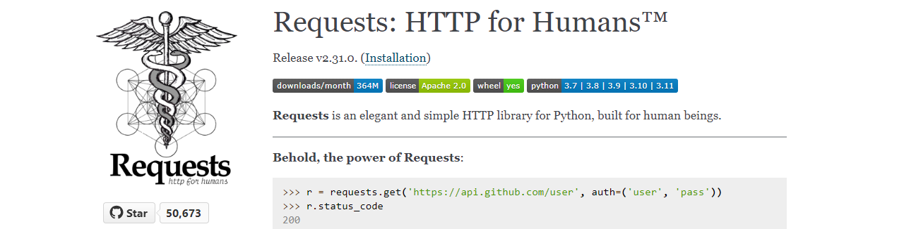

## データのダウンロードと解析

以下、次にURLを示す「港区の公共施設情報」の「区役所・総合支所」を例題に、GeoJSONデータのダウンロードと解析方法を示します。

```Python
url = 'https://opendata.city.minato.tokyo.jp/dataset/74c06ebb-47dd-4fe1-8ba7-a5be60d2a448/resource/' +
    'f1a1056b-a00e-4c12-8a78-288e0eee7ba0/download/minatokushisetsujoho_kuyakusyo.json'
```

データはブラウザからでも閲覧できますが、Pythonプログラムからアクセスするなら、[Requests](https://requests.readthedocs.io/en/latest/)パッケージを使います。詳細は、次のURLから調べられます。

```https://requests.readthedocs.io/en/latest/```

<!-- 1280x326 -->


使いかたは簡単で、次の2行を書くだけでGeoJSONデータが取得できます。

```Python
import requests
resp = requests.get(url)
```

`requests.get()`メソッドは、`requests.Response`オブジェクトを返します。ここで着目しているのは、Webサーバが返してきたHTTPボディを収容した`text`属性です。

```Python
>>> type(resp)
<class 'requests.models.Response'>
>>> type(resp.text)
<class 'str'>
>>> len(resp.text)
5213
>>> resp.text[:100]
'{\r\n    "type": "FeatureCollection",\r\n    "features": [\r\n        {\r\n            "type": "Feature",\r\n '
```

応答ボディがJSON形式であるかは、HTTP応答ヘッダの`Content-Type`フィールドから確認できます。ヘッダは、`requests.Response.headers`属性にリストの形で収容されています。

```Python
>>> resp.headers['Content-Type']
'application/json'
```

日本語が文字化けすることもあります。現在使用されている文字エンコーディングは`requests.Response.encoding`属性から確認できます。これがutf-8でなければ、代入することで強制します。JSONで使用される文字はUnicodeと定められており、またそのエンコーディング方式はUTF-8が推奨されているので、決め打ちで強制しても問題はまずありません。

```Python
>>> resp.encoding
'utf-8'
```

Requestsには応答テキストがJSONであるならば、それを分解してPythonオブジェクトにして返す`requests.Response.json()`メソッドがあります。

```Python
json_body = resp.json()
```

GeoJSONはオブジェクト形式（Pythonデータなら辞書型）です。位置情報はトップレベルにある`features`プロパティに収容されています。複数あるので、配列（リスト）です。

```Python
>>> type(json_body)
<class 'dict'>
>>> type(json_body['features'])
<class 'list'>
>>> len(json_body['features'])
7
```

個々の`features`の要素には`geometry`プロパティが収容されていて、その中の`type`属性には位置情報の形状（ジオメトリ）のタイプ名が収容されています。0番目の`features`要素から確認します。

```Python
>>> json_body['features'][0]['geometry']['type']
'Point'
```

基本、どの`features`要素の`type`も同じです（統一性のないデータは使いにくいので）。次の要領で確かめられます。

```Python
>>> [feature['geometry']['type'] for feature in json_body['features']]
['Point', 'Point', 'Point', 'Point', 'Point', 'Point', 'Point']
>>> set([feature['geometry']['type'] for feature in json_body['features']])
{'Point'}
```

`features[].geometry`には`coordinates`プロパティがあり、これが緯度経度の情報です。配列形式で、中身はPointなら2つまたは3つの数値を要素とした配列、LineStringあるいはPolygonならPointの配列（配列の配列）です。Pointは経度、緯度、（あれば）高度の順に並んでいます。

```Python
>>> json_body['features'][0]['geometry']['coordinates']
['139.75163', '35.658203', 0]
```

出力によると、緯度経度情報が文字列（`str`）で記述されています（RFC 7946 3.1.1節は数値を使えと言っていますが）。あとで浮動小数点数に変換します。

`features`の要素には`properties`プロパティが収容されていて、その`features`のメタデータを提供します。値はオブジェクト（辞書）です。読みやすく表示するには、標準ライブラリの`pprint`が便利です。

```Python
>>> from pprint import pprint
>>> pprint(json_body['features'][0]['properties'])
{'URL': '<a '
        "href='https://www.city.minato.tokyo.jp/shisetsu/kuyakusho/kuyakusho/01.html' "
        "target='_blank'>https://www.city.minato.tokyo.jp/shisetsu/kuyakusho/kuyakusho/01.html</a>",
 'タイトル': '港区役所',
 '分類': '区役所',
 '地区': '芝地区',
 '所在地': '港区芝公園一丁目5番25号',
 '連絡先': '電話：03-3578-2111（代表） ファックス：03-3578-2034'}
```

メタデータの構造はデータセットによって異なります（GeoJSONの仕様では中身は規定されていない）。

地図の作成には緯度、経度の情報は必須です。付随情報としては、ここでは施設名（タイトル）、住所（所在地）だけに興味があるので、これらを抽出し、まとめて辞書のリストを作成します。こんな辞書です。

```Python
{
    '緯度': float(json_body['features'][0]['geometry']['coordinates'][1]),
    '経度': float(json_body['features'][0]['geometry']['coordinates'][0]),
    '施設名': json_body['features'][0]['properties']['タイトル'],
    '住所': json_body['features'][0]['properties']['所在地']
}
```

あとは、`features`プロパティのすべての要素についてこれを処理すれば、目的のデータが得られます。

```Python
geo_info = []
for features in json_body['features']:
    geo_info.append(
        {
            '緯度': float(features['geometry']['coordinates'][1]),
            '経度': float(features['geometry']['coordinates'][0]),
            '施設名': features['properties']['タイトル'],
            '住所': features['properties']['所在地']
        }
    )
```

中身を確認します（読みやすいように手で整形しています）。

```Python
>>> pprint([', '.join(info.values()) for info in geo_info])
[
 {'住所': '港区芝公園一丁目5番25号', '施設名': '港区役所', '経度': 139.75163, '緯度': 35.658203},
 {'住所': '港区芝公園一丁目5番25号', '施設名': '芝地区総合支所', '経度': 139.751576, '緯度': 35.658185},
 {'住所': '港区六本木五丁目16番45号', '施設名': '麻布地区総合支所', '経度': 139.735091, '緯度': 35.660657},
 {'住所': '港区赤坂四丁目18番13号', '施設名': '赤坂地区総合支所', '経度': 139.731725, '緯度': 35.674775},
 {'住所': '港区高輪一丁目16番25号', '施設名': '高輪地区総合支所', '経度': 139.734045, '緯度': 35.642076},
 {'住所': '港区芝浦一丁目16番1号', '施設名': '芝浦港南地区総合支所', '経度': 139.751501, '緯度': 35.646408},
 {'住所': '港区台場一丁目5番1号', '施設名': '芝浦港南地区...分室',  '経度': 139.777312,  '緯度': 35.629723}
]
```

続いて、このデータ（辞書）をPlotly Expressに投入して地図に位置をマーキングします。
