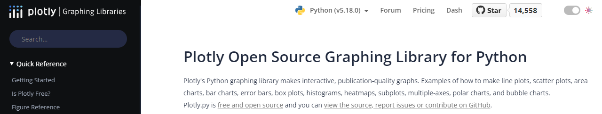
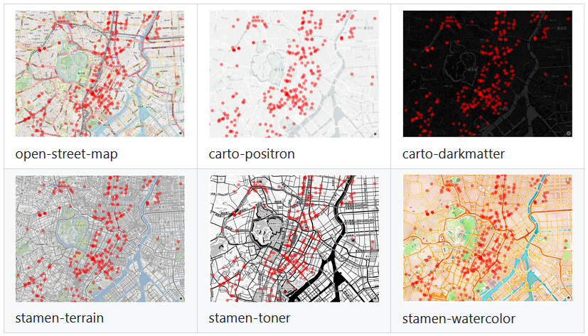

## GeoJSON Pointデータのプロット

地理情報（緯度と経度）の位置を地図にプロットするには、[Plotly](https://plotly.com/python/)を使います。詳細は次のURLから確認できます。

```https://plotly.com/python/```

<!-- 1280 x 244 -->


使用するのは、Plotlyに複数あるグラフィックライブラリのうちのExpressです。地図に点位置を描画するには[`px.scatter_mapbox()`](https://plotly.com/python-api-reference/generated/plotly.express.scatter_mapbox.html)メソッドを使います。

例題は前節でダウンロードした「港区の公共施設情報」の[「区役所・総合支所」](https://opendata.city.minato.tokyo.jp/dataset/74c06ebb-47dd-4fe1-8ba7-a5be60d2a448/resource/f1a1056b-a00e-4c12-8a78-288e0eee7ba0/download/minatokushisetsujoho_kuyakusyo.json)です。データはすでに`geo_info`にまとめられているとします。


```Python
>>> pprint(geo_info)
[
 {'住所': '港区芝公園一丁目5番25号', '施設名': '港区役所', '経度': 139.75163, '緯度': 35.658203},
 {'住所': '港区芝公園一丁目5番25号', '施設名': '芝地区総合支所', '経度': 139.751576, '緯度': 35.658185},
 {'住所': '港区六本木五丁目16番45号', '施設名': '麻布地区総合支所', '経度': 139.735091, '緯度': 35.660657},
 {'住所': '港区赤坂四丁目18番13号', '施設名': '赤坂地区総合支所', '経度': 139.731725, '緯度': 35.674775},
 {'住所': '港区高輪一丁目16番25号', '施設名': '高輪地区総合支所', '経度': 139.734045, '緯度': 35.642076},
 {'住所': '港区芝浦一丁目16番1号', '施設名': '芝浦港南地区総合支所', '経度': 139.751501, '緯度': 35.646408},
 {'住所': '港区台場一丁目5番1号', '施設名': '芝浦港南地区...分室',  '経度': 139.777312,  '緯度': 35.629723}
]
```

まず、Plotly Expressをインポートします。関連に従って、`px`と別名を付けます。

```Python
import plotly.express as px
```

`px.scatter_mapbox()`で`geo_info`の位置情報をマーキングするには次のようにします。

```Python
fig = px.scatter_mapbox(
    data_frame = geo_info,
    lat = '緯度',
    lon = '経度',
    hover_name = '施設名',
    center = {'lat':35.65915518488515, 'lon':139.74528644617095},   # 東京タワー,
    zoom = 14,
    mapbox_style='open-street-map',
    opacity=0.5
)
```

[メソッドのマニュアル](https://plotly.com/python-api-reference/generated/plotly.express.scatter_mapbox.html)を見るといろいろなオプションがありますが、重要なものはデータセットを指定する`data_frame`、その中に収容されている緯度と経度の列（辞書のプロパティ）を指定する`lat`と`lon`です。

キーワード引数の`mapbox_style`には、地図のスタイルを指定します。登録不要で利用できるものには次の6つがあります。

<!-- 827 x 473 -->


見やすくするように地図のレイアウト（上下左右のマージン）を変更し、ついでにタイトルを付けるには`fig`の[`update_layout()`](https://plotly.com/python-api-reference/generated/plotly.graph_objects.Figure.html#plotly.graph_objects.Figure.update_layout)メソッドを使います。

```Python
fig.update_layout(
	margin={"r": 0, "t": 40, "l": 0, "b": 0},
	title_text="港区区役所"
)
```

マーカーの形状などを変更するには[`fig.update_traces()`](https://plotly.com/python-api-reference/generated/plotly.graph_objects.Figure.html#plotly.graph_objects.Figure.update_traces)です。

```Python
fig.update_traces(marker={'size': 20, 'color': 'red'})
```

あとは、得られた`fig`からWebブラウザに表示する、あるいはHTMLファイルとして保存するだけです。

```Python
fig.show()
fig.write_html('Minatoku_Councils.html')
```

HTMLファイルはそのまま開けます。中身はJaVaScriptです。

前章と組み合せて1本のスクリプトにしたものは、本Githubの[`Codes/points.py`](./Codes/points.py)にあります。