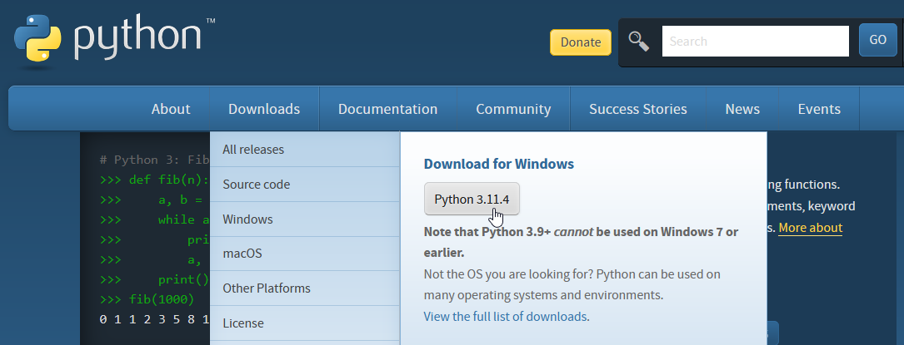

# オープンデータの活用～GeoJSON + Python Plotly

### 目的

本セミナーでは、[オープンデータ](https://ja.wikipedia.org/wiki/オープンデータ "LINK")へのアクセスとその処理を説明します。オープンデータの中身は多様で、アクセス方法やデータフォーマットにいろいろありますが、ここでは例題として次のものを対象とします。

- アクセス方法はストレートなHTTPS（Webと同じなので、データはブラウザからも閲覧可）。
- データ形式は[GeoJSON](https://ja.wikipedia.org/wiki/GeoJSON "LINK")の地理情報。GeoJSONは経緯度などの位置情報を収容することを目的に定義されたJSONフォーマットです。
- データソースは[東京都 オープンデータカタログサイト](https://portal.data.metro.tokyo.lg.jp/ "LINK")掲載のもの。現在41セットあります。
- 抽出結果は[Python Plotly](https://plotly.com/python/ "LINK")で地図に示します。

サンプルは[『Webスクレイピング～Pythonによるインターネット情報活用術』](https://github.com/stoyosawa/ScrapingBook-public "LINK")（2023年8月）の［出力例］の第11、12章から見ることができます。

> JSON形式のオープンデータを`jq`を使ってコマンドラインでカジュアルに確認したい方は、[オープンデータの活用～JSON + jqパーザ](../OpenData-Jq "LINK")を参照してください。


### 受講対象者

位置情報のオープンデータで何かできないかと考えている方。


### 実習環境

Pythonはマルチプラットフォームなので、環境は問いません。講師は[Windows Subsystem for Linux](https://docs.microsoft.com/en-us/windows/wsl/ "LINK")を使っています。


### インストール

まずはPythonです。[python.org](https://www.python.org/ "LINK")のメインページから実行形式のインストーラがダウンロードできるので、実行・インストールします。

<!-- 1085 x 415 -->


外部ライブラリをPIPからインストールします。使用するのは、①Webアクセス用の[Requests](https://requests.readthedocs.io/en/latest/ "LINK")、②グラフ描画の[Plotly](https://plotly.com/python/ "LINK")です。

```
python -m pip install -U pip
pip install requests
pip install plotly
```


### 参考書籍

- 豊沢聡: 『[Webスクレイピング～Pythonによるインターネット情報活用術](https://www.cutt.co.jp/book/978-4-87783-541-5.html "LINK")』, カットシステム（2021年8月）


