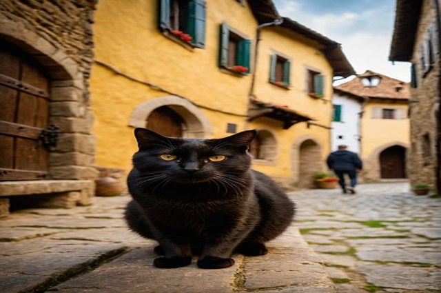
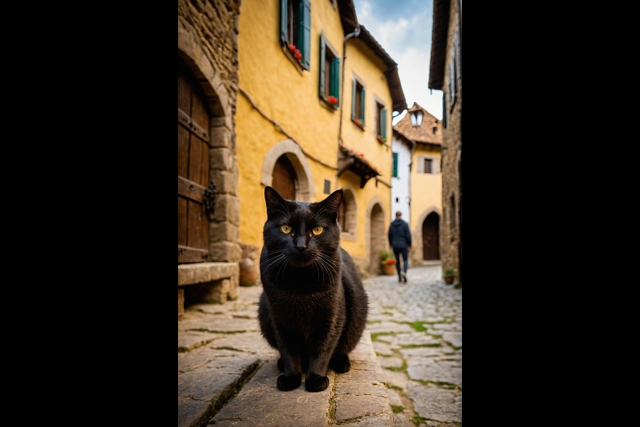

## 4. 画像サイズを揃える

#### 画像のリサイズ

Pillowの標準的なリサイズ関数は`Image.resize`ですが、指定のサイズぴったりに合わせるので、アスペクト比がおかしくなります。たとえば、6枚目の画像は縦長の`(425, 640)`なので、強引に`(640, 427)`にすると、ずいぶん横ぶくれな猫になります。

```python
>> imgs[5].size                            # 元のサイズ
(425, 640)

>>> size                                   # 変更後のサイズ
(640, 427)

>>> imgs[5].resize(size).save('fatcat.png')
```




#### 枠に収まるようにリサイズ

ここで必要なのは次のようなリサイズです。

- アスペクト比は変更しない。
- 目標のサイズを額縁のような「枠」と考え、その枠に収まるようにリサイズする。
- 「枠」と異なるアスペクト比の元画像だと余白が残るが、そこは塗りつぶす（ここでは黒）。

自力で計算するとなるとちょっとだけ面倒ですが、Pillowの`ImageOps`モジュールにはまさにそれをやってくれる関数[`ImageOps.pad`](https://pillow.readthedocs.io/en/stable/reference/ImageOps.html#PIL.ImageOps.pad)があります。

```python
>>> ImageOps.pad(imgs[5], size, color='black').save('regularcat.png')
```

`ImageOps`の諸関数はすべてクラスメソッドです。第1引数には元画像を、第2引数にはターゲットのサイズ（枠）をそれぞれ指定します。背景色は`color`キーワード引数から指定できます。色は[HTML/CSSで使える色名](https://developer.mozilla.org/ja/docs/Web/CSS/named-color)が使えます。もちろん、0～255のRGB値をタプルで指定してもかまいません。他にも、余白をどこに作るかを指定するオプションもありますが、ここではデフォルトの中央揃えのままにしています。

戻り値は変更後の`Image`オブジェクトです。ここでは変数に落とさず、そのまま`Image.save`からファイルに保存しています。

上記の結果を示します。




#### 全部リサイズ

全部、同じサイズにリサイズします。

```python
>>> resized = [ImageOps.pad(img, size=size, color='black') for img in imgs]
>>> resized
[
	<PIL.Image.Image image mode=RGB size=640x427 at 0x7FFDF0EED900>,
	<PIL.Image.Image image mode=RGB size=640x427 at 0x7FFDF0EED9C0>,
	<PIL.Image.Image image mode=RGB size=640x427 at 0x7FFDF0EED990>,
	<PIL.Image.Image image mode=RGB size=640x427 at 0x7FFDF0EED8D0>,
	<PIL.Image.Image image mode=RGB size=640x427 at 0x7FFDF0EED8A0>,
	<PIL.Image.Image image mode=RGB size=640x427 at 0x7FFDF0EEDB70>,
	<PIL.Image.Image image mode=RGB size=640x427 at 0x7FFDF0EED870>
]
```


#### おまけ～色名

Pillowで使える色名は`ImageColor`モジュールの`colormap`辞書に収容されています。キーが色名、値がRGBタプルまたは`#`表記の16進数です。

```python
>>> from PIL import ImageColor
>>> ImageColor.colormap
{
	'aliceblue': (240, 248, 255),
	'antiquewhite': '#faebd7',
	...
}
```

現在、148色が定義されています。

```python
>>> len(ImageColor.colormap.keys())
148
```
