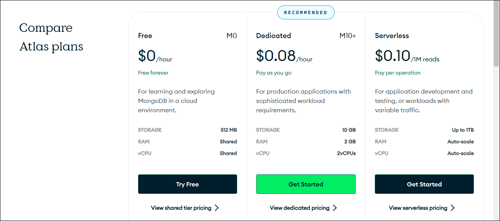

## 1. MongoDBってどんなデータベース？

MongoDBは、辞書（`dict`）やリスト（`list`）やバイト列（`bytes`）で構造化されたPythonデータをそのままの恰好で受け付けます。画像もワードファイルもOKです。

### MongoDBのデータ形式

MongoDBは、[JSON](https://www.oracle.com/jp/database/what-is-json/#data-types "LINK")形式でデータを表現・収容するタイプのデータベースです。JSONはPythonの辞書`dict`などの基本型とほぼ同じなので、PythonとMongoDBは直接的にデータを交換できます。

JSONを使うという点で、表形式を使う一般的なデータベース（リレーショナル型）とは異なるタイプのデータベースです（NoSQLの「ドキュメント型」に分類されますが、呼称は気にしなくて結構です）。

### MongoDB Atlas

MongoDBにはホストシステムにインストールして運用するタイプと、オンラインで使えるクラウドタイプがあります。ユーザレベルでは、使い勝手に変わりはありません。ここで紹介するのは、[MongoDB Atlas](https://www.mongodb.com/ja-jp/atlas/database "LINK")と呼ばれる後者のクラウドタイプです。

MongoDB Atlasは無償で利用できます。ストレージサイズが小さくてシステムリソースが共有という制約はありますが、カジュアルな目的にはこれで十分です。シリアスな用途には[有償版](https://www.mongodb.com/pricing "LINK")もあります。

### MongoDBの構造

MongoDB Atlasでは、データベースインスタンスを「**クラスタ**」と呼びます（。ホストシステムで稼働するものなら「プロセス」や「サーバ」と呼ばれるものです。クラスタは普通、1つ（ひとかたまり）だけ使います（複数あってもかまわないが）。

クラスタには複数の「**データベース**」を収容できます。これは、リレーショナル型でもデータベースと呼ばれるものに相当します。Excelのようなスプレッドシートアプリケーションなら1つのファイルにまとめられるものです。

データベースには複数の「**コレクション**」を収容できます。これはリレーショナル型では「テーブル」（表）に、Excelでは「シート」に相当します。

コレクションには複数の「**ドキュメント**」が収容できます。テーブル上の各レコード（行）やExcelの1行に相当します。MongoDBでは、これは1つのJSONオブジェクトです。

テーブルコラム（表の列）は「**フィールド**」と呼ばれます。リレーショナル型では列はまんべんなく埋まっていなければなりませんが（該当する値がなければ`NULL`を使う）、MongoDBではフィールドの欠落が許されています。

データベースの構造を示す用語を次の表にまとめます。

リレーショナル | MongoDB | スプレッドシート
---|---|---
データベース | データベース | ファイル
テーブル（表） | コレクション | シート（タブ）
レコード（行） | ドキュメント（JSONテキスト） | 行
コラム（列） | （JSONオブジェクトの）フィールド | 列

ドキュメントを挿入すると、MongoDBはそれぞれのドキュメントに一意な`_id`というフィールドを自動的に挿入します。`_id`フィールドはリレーショナルデータべースのプライマリキーのような役割を果たします。

### JSON

オリジナルの[JSON](https://www.oracle.com/jp/database/what-is-json/#data-types "LINK")は、次のデータ型の組み合わせですべてのデータを表現します。

- 数値（number）
- 文字列（string）
- 真偽値（boolean。`true`または`false`）
- `null`
- 配列（array。要素はどのデータ型でもよい）
- オブジェクト（object）

これらはPythonの組み込みデータ型と**おおむね**一致しています。

MongoDBは、JSONの変形判（バイナリ版）の[BSON](https://www.mongodb.com/ja-jp/docs/manual/reference/bson-types/ "LINK")を使っています。BSONでは数値は文字列表記の数字の羅列でなく、Pythonのように整数型（`int`）や浮動小数点数型（`float`）に分かれて定義されていますが、使うぶんには詳細は気にしなくても問題はありません。データ型は拡張されていて、オリジナルでは表現できないバイナリ（`bytes`）や日時（`datetime.datetime`）も使えます。
