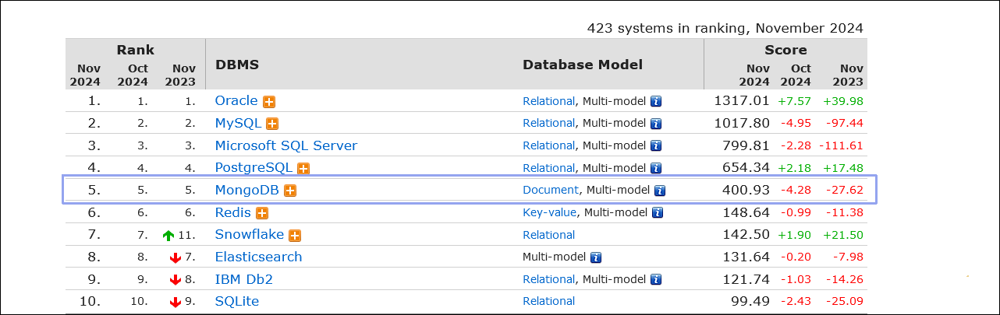
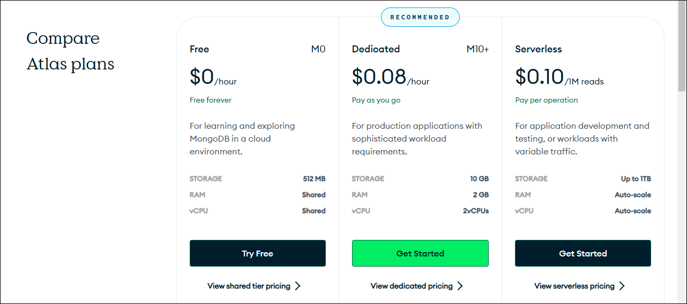

## 1. ドキュメントデータベース

### ドキュメントデータベースとは

[ドキュメント型データベース](https://en.wikipedia.org/wiki/Document-oriented_database "LINK")は、データベースで一般的な表形式の構造を取らず、プログラムで普通に用いる方法でデータを表現・収容するタイプのデータベースです。「ドキュメント」を名乗っていますが、普通のテキストやワードなどの文書ファイルとは関係はありませんし、それらを収容するものでもありません。

SQLを使わないデータベースの総称である[NoSQL](https://ja.wikipedia.org/wiki/NoSQL "LINK")タイプの一種です。

「普通に用いる」と言いましたが、データフォーマットにはJSONが一般的です（XMLやYAMLを使うものもあります）。

ドキュメント型データベースの特徴や主たる用途は、AWSの「[ドキュメントデータベースとは](https://aws.amazon.com/jp/nosql/document/ "LINK")」に詳しいです（AWSにも DocumentDBというドキュメント型データベースサービスがあります）。

```https://aws.amazon.com/jp/nosql/document/```

### MongoDB

本セミナーで紹介するMongoDBはデータをJSON形式（正確にはそのバイナリ版のBinary JSON）で収容するドキュメント型データベースです。

MongoDBはNoSQLの中でもトップクラスの人気を誇っています。データベースの人気ランキングは次にURLを示す[DB-Engines](https://db-engines.com/en/ranking "LINK")から確認できます。




### MongoDB Atlas

MongoDBには、一般のデータベースサーバ同様にホストシステムにインストールして運用するタイプのものと、オンラインで使えるクラスタタイプのものがあります。ここで紹介するのは後者のクラスタタイプで、[MongoDB Atlas](https://www.mongodb.com/ja-jp/atlas/database "LINK")と呼ばれています。使い勝手に変わりはありません。

MongoDB Atlasは無償で利用できます。ストレージサイズが小さく、システムリソースが共有と、制約はありますが、カジュアルな目的にはこれで十分です。シリアスな用途には[有償版](https://www.mongodb.com/pricing "LINK")もあります。




### MongoDBのデータ構造

MongoDBインスタンスには、複数の「**データベース**」を収容できます。

データベースには複数の「**コレクション**」を収容できます。これはリレーショナル型では「テーブル」（表）に、Excelのようなスプレッドシートアプリケーションでは「シート」に相当します。

コレクションには複数の「**ドキュメント**」が収容できます。テーブル上の各レコード（行）やExcelの1行に相当します。MongoDBでは、これは1つのJSONオブジェクトです。

テーブルコラム（表の列）は「**フィールド**」と呼ばれます。リレーショナル型では列はまんべんなく埋まっていなければなりませんが（該当する値がなければ`NULL`を使う）、MongoDBではフィールドの欠落が許されています。

データベースの構造を示す用語を次の表にまとめます。

リレーショナル | MongoDB | スプレッドシート
---|---|---
データベース | データベース | ファイル
テーブル（表） | コレクション | シート（タブ）
レコード（行） | ドキュメント（JSONテキスト） | 行
コラム（列） | （JSONオブジェクトの）フィールド | 列

ドキュメントを挿入すると、MongoDBはそれぞれのドキュメントに一意な`_id`というフィールドを自動的に挿入します。`_id`フィールドはリレーショナルデータべースのプライマリキーのような役割を果たします。


### JSON

JSONは、次のデータ型の組み合わせですべてのデータを表現します。

- 数値（number）
- 文字列（string）
- 真偽値（boolean。`true`または`false`）
- `null`
- 配列（array。要素はどのデータ型でもよい）
- オブジェクト（object）

これらはPythonの組み込みデータ型とおおむね一致しています。

JSONの数値には整数（`int`）や浮動小数点数（`float`）など細かい区別はありません。有効桁数やビット数にも仕様上は制限はありませんが、32ビット浮動小数点数（[IEEE 754](https://ja.wikipedia.org/wiki/IEEE_754 "LINK")）を超えた範囲は実装依存依存なので、使うべきではありません。JSONには複素数型（complex）はありません。

JSONの文字列は必ず二重引用符でくくらなければなりません。Pythonのように単一引用符は使えません。

真偽値はPythonでは`True`、`False`です。大文字小文字に注意します。

`null`は`None`です。

配列はリスト（`list`）です。pythonの`tuple`も区別なく配列扱いです。

オブジェクトは辞書（`dict`）です。

細かいことを確認したくなったら、公式の仕様である[RFC 8259 "The JavaScript Object Notation (JSON) Data Interchange Format"](https://www.rfc-editor.org/info/rfc8259 "LINK")を参照します。
