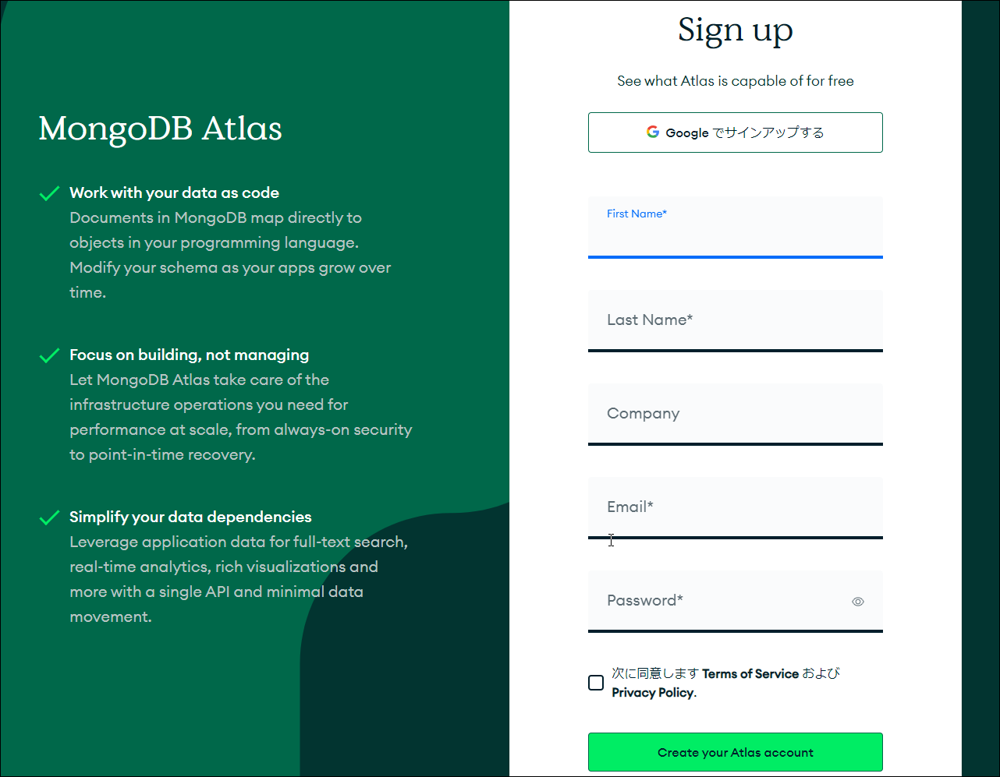

<!-- Node.js版をコピー -->
## 2. MongoDB Atlasのアカウント作成

Atlasにアカウントを作成するには次の事項を設定します。

- Atlasのアカウント（メールアドレスとパスワード）
- Atlasのクラスタタイプ（料金とクラウドプロバイダ）
- データベース管理者アカウント
- データベースアクセス制限

<!-- Firefox + uBlock Origin だと Atlas にログインできないみたい (2024-11-09) -->

### ①トップページ

[MongoDB Atlas](https://www.mongodb.com/ja-jp/atlas/database "LINK")のトップページにアクセスします。フロントページは日本語ですが、以降は英語です。

大書された「マルチクラウド」はAmazon、Google、Microsoftの3つのクラウドサービスを取り混ぜて利用できるという意味ですが、カジュアルな利用では1つあれば十分です。「デプロイ」はクラウド上にデータベースを使用できるようにするという意味です。

ページ下端の［無料で試す］ボタンをクリックし、次に移ります。

### ②ユーザ登録

遷移した「Sign Up」ページから、氏名、社名（任意）、メールアドレス、パスワードを設定し、契約条項にチェックを入れ、［Create your Atlas account］（Atlasアカウントを作成）ボタンをクリックします。Googleのアカウントを流用するなら、［Googleでサインアップする］を選択します。

画面が「Great, now verify your email」（メールを確認してください）に遷移します。

しばらくすると、登録したアドレスに確認メールが届くので、メールにある［Verify email］をクリックします。

画面が「Email successfully verified」（メール検証が完了しました）に移動するので、［Continue］ボタンから続行します。

### ③多要素認証

[多要素認証](https://www.nri.com/jp/knowledge/glossary/lst/ta/multi_factor_authentication "LINK")（MFA：Multi Factor Authentication）を使うかのページに遷移します。

MFAは、ログイン名とパスワードに加え、テキストメッセージや携帯アプリを介して多重的にアクセス認証をするメカニズムです。ショッピングサイトや銀行などのオンラインサービスでは、セキュリティ確保のために標準的に用いられています。使用するなら［Set up now］を、使わないなら［Remind me later］（あとで）を選択します。あとからでも設定できるので、ここでは後者を選択します。

多要素認証を設定しないと、ログイン時に再び訊かれることがあります。必要なければ無視して結構です（講師も使っていません）。

### ④アンケート

「Welcome」画面などが一時的に表示され、しばらくするとアンケートページが現れます。

上2つの質問は目的、MongoDBの経験年数です。続く3つは使用するプログラミング言語、データの種類、アーキテクチャモデルです。最後の2つは複数選択式になっています。わからなければ「Not sure」（不明）で結構です。

この情報は、Atlas画面を使用目的に合わせてカスタマイズするのに使われます。思ったようにカスタマイズされなくても、あとから自分で変更できます。

回答を記入したら［Finish］をクリックします。

### ⑤クラスタの構築

続く「Deploy your database」画面でクラスタをクラウド上に構築します。

上部に並ぶ3つの選択肢から、クラスタのサイズを選択します。ディスク容量やRAMにとくに要求がなければ、右側の無償版の「M0」で十分です。RAMやcVPU（仮想CPU）が「Shared」とあるのは、使用するデータベースインスタンスの使うリソースが他者と共有されているという意味です。その時点のユーザ数が多いとリソースが不足することも考えられますが、カジュアルな用途で問題になることはないでしょう。

「Provider」（プロバイダ）では、このクラスタを配置するクラウドサービス提供社を選択します。Amazon Web Service、Google Cloud、Microsoft Azureがありますが、Atlasを使っているぶんには違いはありません。その下の「Region」からは、そのクラウドサービスの所在を選びます。利用場所から近ければ近いほど応答速度がよいので、近隣のものを選びます（物理的な距離ではなく、ラウンドトリップタイムの短さで判断します）。利用場所はクラスタのサイズによって異なります（無償版の所在はやや少なめです）。

「Name」では、クラスタに名前を付けます。なんでもかまいません。デフォルトの「Cluster0」のままでもよいです。

「Tag」はクラスタの付加情報で、「キー：値」の構成です。あとから変更できるので、今すぐに設定する必要はありません。

ページ下端の［Create］ボタンをクリックするとデータベースクラスタが作成されます。

### ⑥管理者アカウントの設定

画面が「Security Quickstart」に遷移します。ページ前半の「①How would you like to authenticate your connection?」（どのような方法で接続を認証しますか）セクションからデータベース管理者（admin）アカウントを作成します。

認証方式には「Usesrname and Password」（ユーザ名とパスワード）と「Certificate」（証明書）がありますが、簡単な前者を用いるとします。

ユーザ名は第1候補がメールアドレスから自動的に生成されます。気に入らなければ変更します。パスワードは、［Autogenerate Secure Password］ボタンから無意味で長い文字列を自動生成できます。もちろん、自分で決めたものを手で入力してもかまいません。いずれにせよ、どこかに記録を取っておきます。

用意ができたら、［Create User］ボタンをクリックします。「①」の部分が✔マークに変わります。

### ⑦アクセス制限の設定

同じページの下方にある「②Where would you like to conenct from?」（どこから接続しますか）セクションでは、このデータベースにアクセスできるIPアドレスのリストを作成します。

「My Local Environment」（自分の環境）と「Cloud Environment」（クラウド）の選択肢がありますが、たいていは左の自環境を選択します。

その下の「Add entries to your IP Access List」（IPアクセスリストの追加）にある［Add My Current IP Address］ボタンをクリックすると、現在使用している自機のIPアドレスが下にある「IP Access List」に加えられます。見覚えのないアドレスでしょうが、これは、あなたが使用しているインターネットサービスプロバイダのグローバルIPアドレスです。

他に加えたいIPがあれば、「IP Address」直下のフィールドからIPアドレスを入力し、［Add Entry］ボタンをクリックします。スラッシュ表記のネットワークアドレス形式なので、ネットワーク単位で許可をするのなら、192.168.1.0/24のように書きます。これで、192.168.1.0～192.168.1.255の範囲の256個のIPアドレスからアクセスできます。そのIPアドレスだけピンポイントに許可するなら「/32」をアドレス末尾に付けます。どこからでもアクセスを許可するのなら、0.0.0.0/0を指定します（大事なものはデータベースに置かないように）。

なお、`ifconfig`や`ipconfig`から得られる自機のIPアドレスはプライベートIPアドレスなので、ここでは指定できません。

［Edit］ボタンから編集が、［Remove］ボタンから削除ができます。

ユーザアカウントとアクセスリストはあとから変更できます。

用意できたら、アクティブになった［Finish and Close］ボタンをクリックして設定を完了します。

### ⑧完了

「Congraturations on setting up access rules!」（アクセス規則の設定が完了しました）ダイアログボックスが現れるので、［Go to overview］ボタンをクリックします。

他にもダイアログボックスが出てきますが、適当にいなせば、Atlasのトップページの「Overview」に遷移します。ここから、ここまでの設定を変更できます。画面にある「Cluster0」が、手順⑤で指定したデータベースクラスタの名前です。

