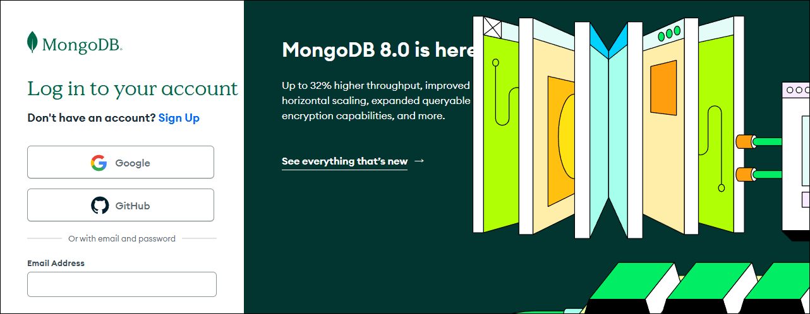
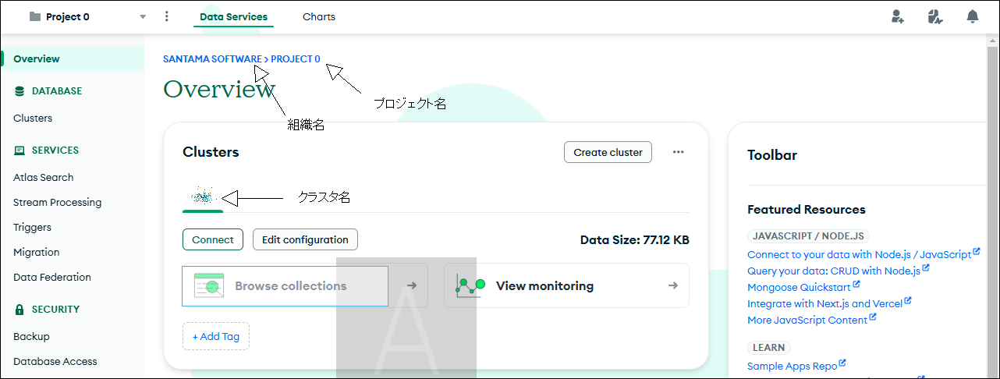
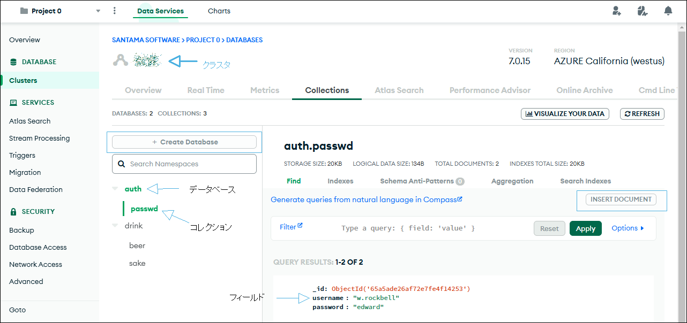
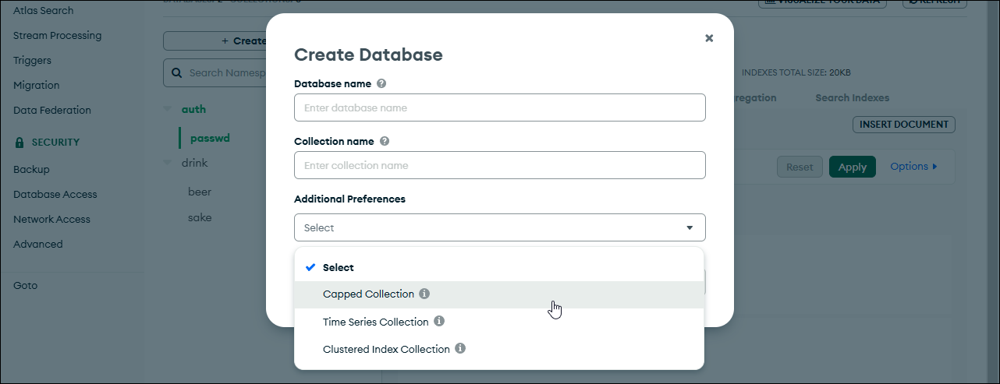
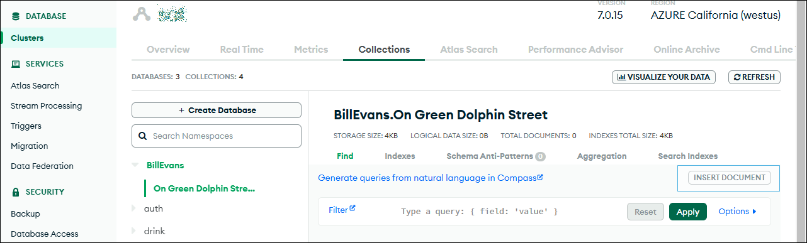
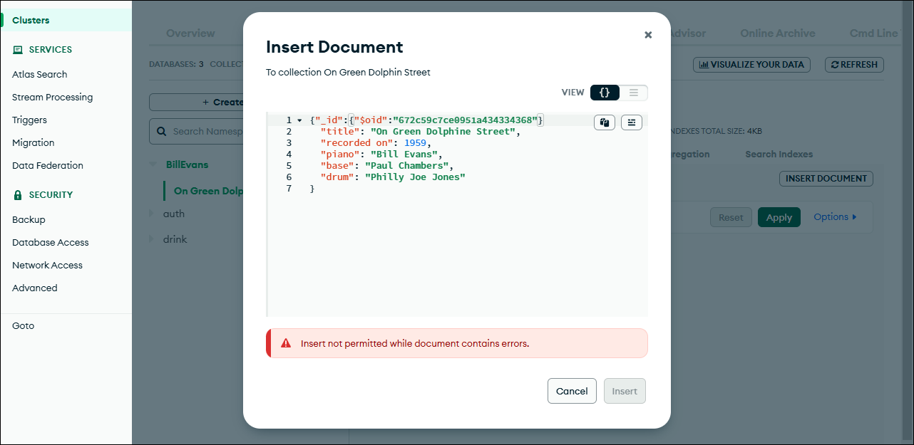
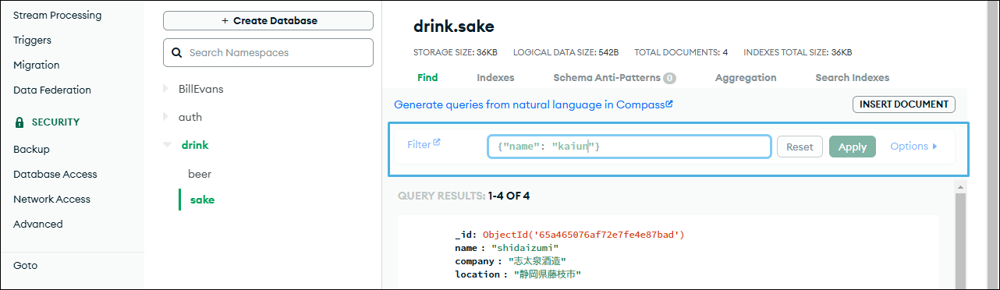
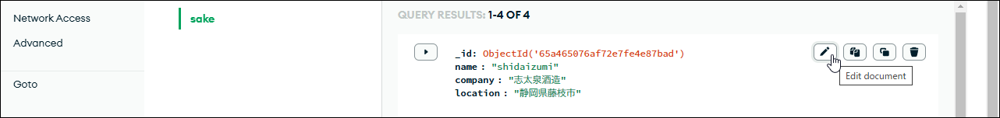

<!-- NoSQL から構造はコピーしたが、手順は変えた。-->
## 3. MongoDB Atlas Webインタフェース

Atlasを介したデータベースの基本操作を説明します。

<!-- 組織 ▸ プロジェクト ▸ クラスタ ▸ データベース ▸ コレクション ▸ ドキュメント -->

### ログイン

MongoDB Atlasの[ログインページ](https://account.mongodb.com/ "LINK")からログインします。

> ログインで使うのはAtlasアカウントです。データベース管理者あるいはユーザではありません。

### トップページ（Overview）

ログインすると「Overview」ページが表示されます。

ページにはクラスタが表示されています。［Browse collections］ボタンをクリックすると、データベースビューに移り、データベースを操作できます。

### データベースの作成

［+Create Database］ボタンをクリックすると、「Create Database」ダイアログが表示されます。

データベース名、最初の1つのコレクションの名前、そしてコレクションの構造を指定します。構造には3つのオプションがあります。

- Capped collection：サイズ上限を設けたコレクションで、上限以上のデータを挿入すると循環式バッファのように古いものから削除されます。
- Time series collection：ドキュメントに必ず時刻情報フィールドが加わるものです。販売記録や株価のようなデータに向きます。
- Clustered index collection: コレクションを`_id`でソートします

普通の用途では、いずれも指定しません。

［Create］ボタンをクリックすれば作成され、データベースビューに戻ります。

### ドキュメントの挿入

ドキュメント（JSONオブジェクト）を挿入するなら（SQLの`INSERT`に相当）、画面右の［INSERT DOCUMENT］をクリックします。

ドキュメント挿入のダイアログボックスが現れます。

入力には2通りのやり方があります。画面右の「VIEW」から`{}`を選ぶとオブジェクト形式で、JSONオブジェクトをリテラルに記述します。`≡`から選べばキー・値形式です。ここではオブジェクト形式にして挿入しています。

入力にエラーがあるときは下部に「Insert not permitted while document contains errors」というエラーメッセージが表示されます。

用意ができたら［Insert］ボタンをクリックします。

### ドキュメントの検索（filter）

コレクションからドキュメントを検索するなら、画面右中央にある「Filter」を使います。検索語は例に示されているように、オブジェクト形式で指定します。たとえば、`name = '開運'`を検索するのであれば、`{"name": "開運"}`を入力します。

用意ができたら［Apply］ボタンをクリックします。

フィルタリングされた状態をもとに戻すには［Reset］ボタンです。

### ドキュメントの更新と削除

ドキュメントのフィールドを更新あるいは削除するなら、そのドキュメントをホバーすれば、右にアイコンメニューが出てきます。

アイコンは左から「編集✎」、「コピー🗐」、「複製⧉」、「削除🗑」です。

### 命名上の注意

データベース、コレクション、フィールドの命名にはいくつか制約があります。

データベース名の制約を次に示します。データベースサーバを運用しているOSの違いなどで制約が異なるものもありますが、ここではより厳しいパターンを掲載します。

- 大文字小文字の違いは無視します。たとえば、`drink`と`Drink`は同じものとして扱われます。
- 次の特殊記号を含めません：`/\. "$*<>:|?`および`null`。
- 最大長は64文字です。

コレクション名の制約を次に示します。

- 先頭文字はアンダースコア`_`または文字のみが使用可能です。
- 最大長は235バイトです。これは、データベース名と`.`で連結したときの全長です。
<!-- 複数形の小文字の仕様が推奨されます。これは、Mongooseの`Model`クラスが、モデル名を複数形、小文字化したコレクションを探すからです。 -->
<!-- See https://mongoosejs.com/docs/models.html -->

フィールド名の制約を次に示します。

- `_id`は予約語（ドキュメントのプライマリキー）なので使えません。
- 文字`$`および`.`は含んではいけません（この制約は緩和されてはいますが、避けるべきです）。
- 重複は認められません。たとえば、`{"name": "志太泉", "name: "磯自慢"}`のようなケースです（JSONそのものの仕様違反ではありませんが、実装依存とされています）。

正確なところは、次のURLに示すMongoDBマニュアルの「[Reference > MongoDB Limits and Threshoold > Naming Restriction](https://www.mongodb.com/ja-jp/docs/manual/reference/limits/#naming-restrictions "LINK")」を参照してください。
