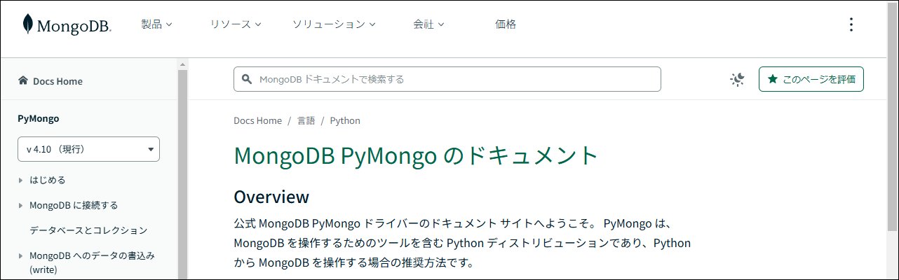
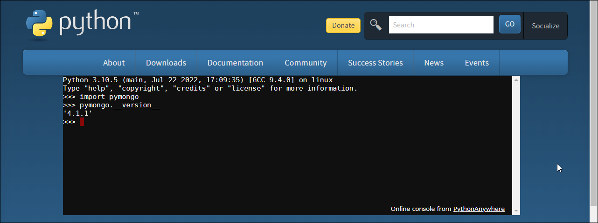
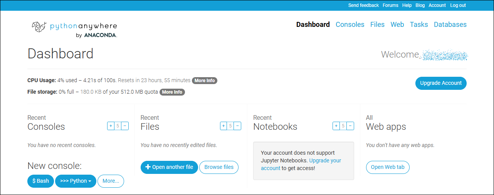
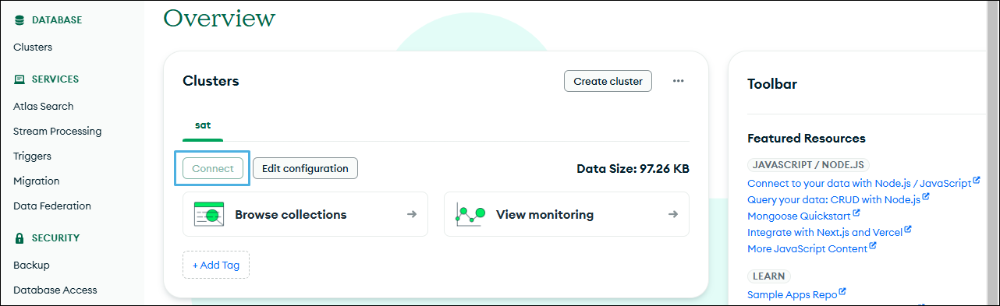
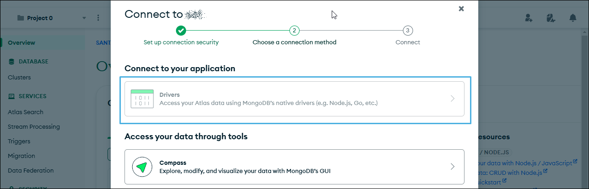
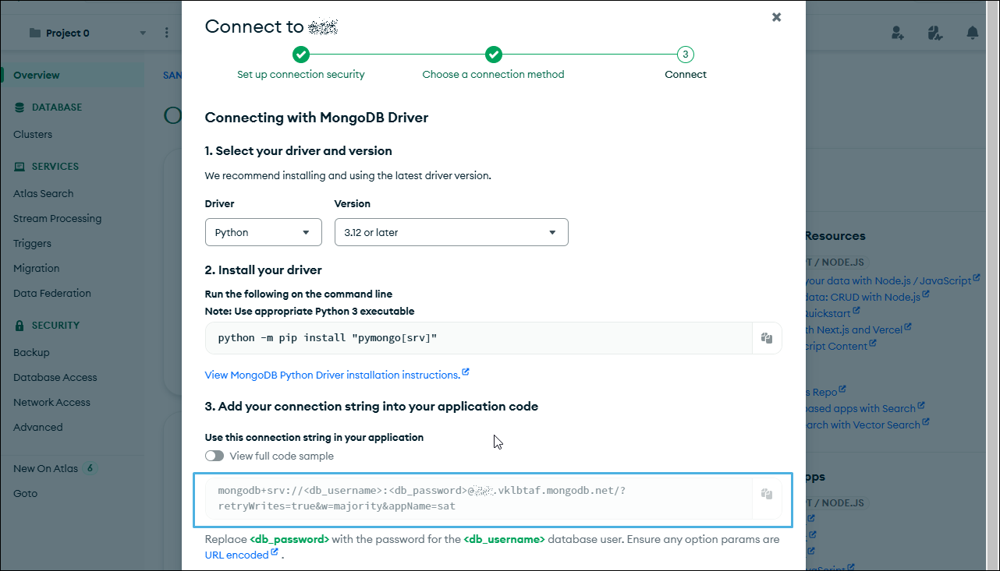

## 4. Pymongoの導入

PythonからMongoDBを操作するには、Pymongoライブラリが必要です。


### インストール

Python用MongoDBドライバーは`pymongo`です。`pip`からインストールします。

```bash
$ pip install pymongo
Collecting pymongo
  Downloading pymongo-4.10.1-cp312-cp312-manylinux_2_17_x86_64.manylinux2014_x86_64.whl.metadata (22 kB)
Collecting dnspython<3.0.0,>=1.16.0 (from pymongo)
  Downloading dnspython-2.7.0-py3-none-any.whl.metadata (5.8 kB)
Downloading pymongo-4.10.1-cp312-cp312-manylinux_2_17_x86_64.manylinux2014_x86_64.whl (1.9 MB)
   ━━━━━━━━━━━━━━━━━━━━━━━━━━━━━━━━━━━━━━━━ 1.9/1.9 MB 16.5 MB/s eta 0:00:00
Downloading dnspython-2.7.0-py3-none-any.whl (313 kB)
   ━━━━━━━━━━━━━━━━━━━━━━━━━━━━━━━━━━━━━━━━ 313.6/313.6 kB 21.1 MB/s eta 0:00:00
Installing collected packages: dnspython, pymongo
Successfully installed dnspython-2.7.0 pymongo-4.10.1
```

バージョンはインストールメッセージの最終行に書かれています。モジュールの`__version__`から再確認できます。

```python
>>> import pymongo
>>> pymongo.__version__
'4.10.1'
```

### Documentation

使い方は[Pymongoドキュメント](https://www.mongodb.com/ja-jp/docs/languages/python/pymongo-driver/current/ "LINK")に詳しく書かれています。



ほぼ全部が和訳されていますが、APIドキュメントは英語のままです。


### 実行

Unix系では、スクリプトファイル先頭に次のように`#!`（シェバン）を書き込みます。その上でファイルパーミッションに実行可（`chmod +x`）を加えれば、ファイル名単体で実行できます。

```bash
#!/usr/bin/env python
```

Windowsではこの手は使えないので、コマンド名とそれに引き渡すファイル名を指定します。

```dos
C:\temp>python script.py
```


### オンライン環境

Pythonが自機の環境になければ、Webブラウザベースのオンライン環境が使えます。

サービスはいろいろありますが、使いたいライブラリが用意されているかロード可能で、サインアップが必要なく、無償であるようなものはそうはありません。講師は、やや応答速度が遅いものの、御本尊の[Python](https://www.python.org/)がおすすめです。`pymongo`も利用可能です。

```https://www.python.org/```



隅に書かれているように、中身は[PythonAnywhere](https://www.pythonanywhere.com)です。アカウントを作成しなければなりませんが、制限付きですが無償で、しかもWebサイトまで運用できます。

```https://www.pythonanywhere.com/```



オンライン環境利用時は、MongoDBアカウントなどセンシティブな情報を保持しないよう注意します。コンソール（`stdin`）からエコーバックなしでパスワードを入力するには`getpass.getpass()`です。

```python
>>> import getpass
>>> p = getpass.getpass()
Password:
>>> p
'test'
```


### 接続文字列の取得

MongoDBクラスタに接続するときに用いるURL文字列（接続文字列）は、Atlasの「Overview」画面にある［Connec］から得られます。



ダイアログボックスでは「Connect to your application」で「Drivers」を選択します。



「Connect to XXX」（クラスタ名）ダイアログボックスには言語環境の選択（第1項目）やドライバのインストール方法（第2項目）がありますが、そこは無視して、3番目の「Add your connection string into your application code」にあるURLをコピーします。



URLのフォーマットは次のとおりです（`?`以下のクエリ文字列は接続に必須ではありません）。

```mongodb+srv://<db_username>:<db_password>@<cluster_name>.vklbtaf.mongodb.net/```

`<db_username>`と`<db_password>`は「[2. MongoDB Atlasの⑥管理者アカウントの設定](./02-Account.md#⑥管理者アカウントの設定 "INTERNAL")」で設定したものです（一般ユーザのほうが好ましければ、Webインタフェースから作成します）。

URLに埋め込まれたユーザーの認証情報はUser Informationという権限元の副要素です（詳細は[RFC 3986 Section 3.2.1](https://datatracker.ietf.org/doc/html/rfc3986#section-3.2.1 "LINK")）。User Informationの使用は最近では好ましくはないとされているので、ここではそれを取り除いて用います。

```mongodb+srv://<cluster_name>.vklbtaf.mongodb.net/```

Atlasのデフォルトポートは270171です。
