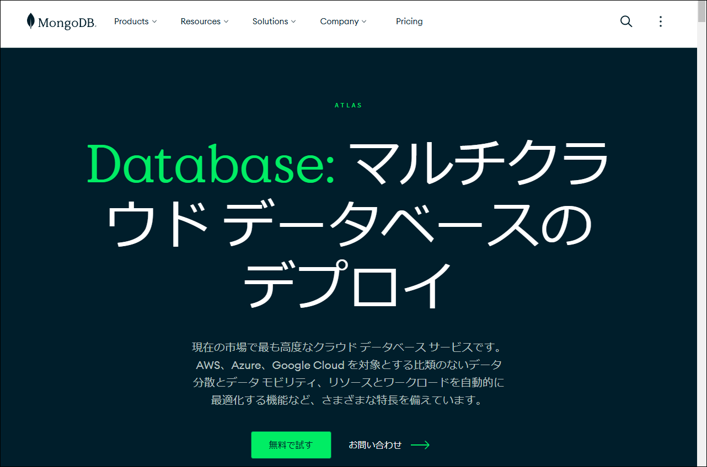

# クラウドデータベースでデータを共有しよう～MongoDB Atlas＋Pymongo

### 目的

[MongoDB Atlas](https://www.mongodb.com/ja-jp/products/platform/atlas-database "LINK")を使って、データを共有する方法を示します。

クラウド型データベースサービスなので、ネットに繋がっていればどこからでも、アクセス許可があれば誰でもデータの作成、閲覧、更新、削除ができます。JSON形式でデータを管理しているので、Pythonスクリプト内の辞書やリストと直接データ交換できます。

Atlasの無償利用の範囲は512 MBまでですが、画像など大きなものを保存しなければ、小さなプロジェクトには十分です。

### プログラム

セミナーの時間は60分です。

1. [MongoDBってどんなデータベース？](./01-Introduction.md "INTERNAL")
2. [MongoDB Atlas～アカウントの作成](./02-Account.md "INTERNAL")
3. [MongoDB Atlas～Webインタフェースでの操作](./03-Web.md "INTERNAL")
4. [Pymongoのインストール](./04-Install.md "ITNERNAL")
5. [Pymongoの使い方](./05-Pymongo.md "ITNERNAL")

### 環境

- プログラミング言語: [Python](https://www.python.org/ "LINK")
- 使用する外部ライブラリ: [Pymongo](https://www.mongodb.com/ja-jp/docs/languages/python/pymongo-driver/current/ "LINK")

オンラインPythonからも実行できます（たとえば[PythonAntwhere](https://www.pythonanywhere.com/ "LINK")。要領に変わりはありません。

### 注意

MongoDB AtlasのWebインタフェース画面は頻繁に変更されます。本資料の画面は作成時のもので、セミナー時とは異なることがあります。

### 受講の条件

1～4には履修条件はありません。

5では、Pythonプログラミングの初級レベルの経験が必要です。
