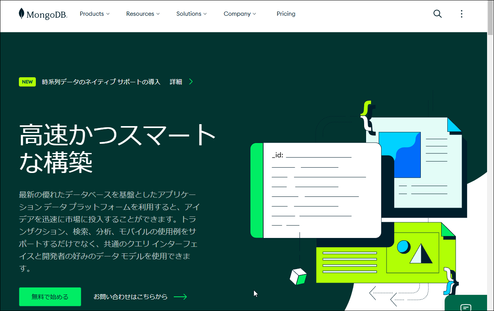

# Pythonのデータをクラウドデータベースで管理しよう～MongoDB Atlas＋Pymongo

> 作成中

### 目的

本セミナーでは、ドキュメント型データベースの1つである[MongoDB](https://www.mongodb.com/ja-jp "LINK")で、Pythonのデータを管理する方法を示します。

クラウド型のデータベースサービスはAWSなどいろいろありますが、ここで紹介するMongoDB Atlasは、アカウントを作成するだけで即座に利用できるので便利です。クレジットカードの提示も求められないので、課金されたらどうしよう、と悩まなくて済むのも嬉しいところです。

### プログラム

セミナーの時間は90分です。

1. [ドキュメントデータベースとは](./01-Introduction.md "INTERNAL")
2. [MongoDB Atlas～アカウントの作成](./02-Account.md "INTERNAL")
3. [MongoDB Atlas～Webインタフェースでの操作](./03-Web.md "INTERNAL")
4. [Pymongoのインストール](./04-Install.md "ITNERNAL")
5. [PymongoからMongoDB Atlasにアクセス～Mongoose](./05-Pymongo.md "ITNERNAL")

### 環境

- プログラミング言語: [Python](https://www.python.org/ "LINK")
- 使用する外部ライブラリ: [Pymongo](https://www.mongodb.com/ja-jp/docs/languages/python/pymongo-driver/current/ "LINK")

オンラインPythonからも実行できます。要領は同じなので、本セミナーでは時期に環境が整っているとして説明します。

### 受講の条件

1～4には履修条件はありません。

5では、Pythonプログラミングの初級レベルの経験が必要です。
