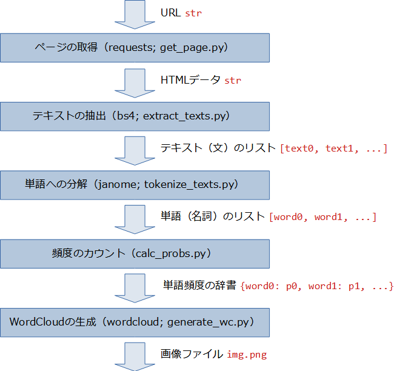

## はじめに

ここでは、Webスクレイピングを次図のように5つのタスクに分け、それぞれでスクリプトを用意します。そして、これらを流れ作業のように連係することで、指定のURLからワードクラウド画像を生成します。



括弧に示したのは、それぞれのステップで利用するパッケージ名と作成するスクリプト名です。

矢印で示したのは、それぞれのスクリプトの入力と出力です。たとえば、ページを取得する`get_page.py`はURL（文字列）を受け、HTMLデータ（文字列）を返します。そして、次段の`extract_texts.py`はHTMLデータ（文字列）を受け、テキスト（画面上に現れるヒトが読む文章）のリストを返します。最後のスクリプトが、ワードクラウド画像をファイルとして（`img.png`）を保存します。


### Pythonパッケージのインストール

Pythonはすでにインストールしてあるとして、本セミナーで利用する4つのパッケージを以下の要領でインストールします。

```
python -m pip install -U pip
pip install requests
pip install beautifulsoup4
pip install janome
pip install wordcloud
```

インストールの詳細は[付録A](./A-Install.md "LINK")を参照してください。


### 本セミナーのスクリプトのダウンロード

5本のスクリプトは[`./Codes/wc.zip`](./Codes/wc.zip "CODE")にZIPでまとめてあります。ダウンロードして、展開してください。


### とりあえず試そう

では、スクリプトを試してみましょう。次の要領で実行します。

```
$ python generate_wc.py https://www.cutt.co.jp/
```

非常にシンプルなスクリプトなので、URLによっては期待通りには動作しないかもしれません。

