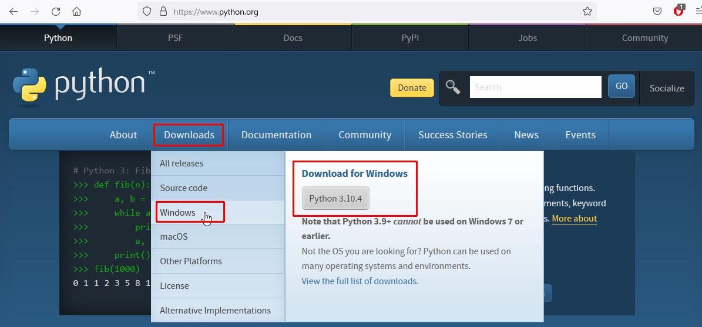
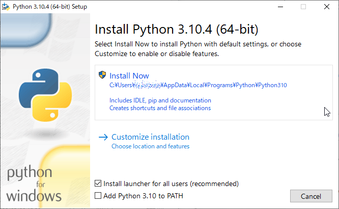
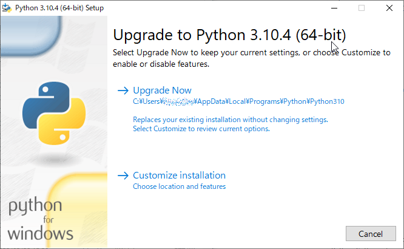
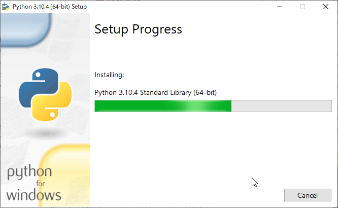
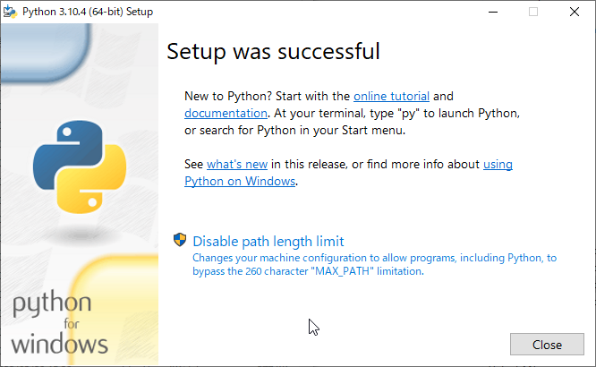

## インストール

まず[Python](https://www.python.org/ "LINK")本体を、続いてこのセミナーで利用するパッケージをインストールする方法を説明します。

いずれもマルチプラットフォーム対応なので環境依存性はほとんどありませんが、ここではWindowsに限定して記述します。他環境では、たとえばWindowsコマンドプロンプトをUnixコンソールに読み替えるなどしてください。

`pip`を用いたインストールでは、管理者権限が必要なこともあります。権限不足でエラーが発生するようなら、コマンドプロンプトを（アイコンを右クリックすることでメニューを引き出し）［管理者として実行］します。


### Python

<!--- Pillow/PIL 本からコピペ --->

次のPythonの公式サイトにアクセスします。

```https://www.python.org/downloads/```

次図のようにページ上部に水平に伸びるメニューがあるので、［Downloads］ボタンをクリックします。プラットフォームが自動認識され、プルダウンメニューから64ビット版の最新の安定リリース（図ではWindows用の3.10.4）が推奨されるので、これを選択します。他のバージョンが必要なら、［Windows］をクリックし選び直します。



**図A.1 Python公式トップページの［Downloads］からインストーラを取得**

> ページで案内されているように、最新版はWindows 7には対応していません。Windows 7は2020年1月にサポートが終了しています。Windows 8は2023年1月にサポート終了予定です。

ダウンロードされるインストーラは`python-3.10.4-amd64.exe`のようなファイル名です。バージョン3.10.4のAMD 64ビット用という意味です。CPUアーキテクチャがAMDとなっていますが、Intelと共通なので問題はありません。

インストーラは次のどちらかの画面からスタートします。左が新規導入、右が既存のインストールがある場合です。

 &nbsp;


**図A.2 インストーラの起動（左：新規、右：更新）**

新規導入では、画面下に［Add Python 3.10 to PATH］のチェックボックスがあります。コマンドプロンプトからPythonを実行できるよう、PATH環境変数に`python.exe`の所在を加えるものです。手作業で環境変数を管理しているのでなければ、チェックを入れます。

あとは、［Install Now］あるいは［Upgrade Now］をクリックしてインストールを開始するだけです。次の画面が表示され、進行状況を報告します。



**図A.3 Pythonインストーラの進行状況**

完了すれば、完了画面が現れます。［Close］ボタンでインストーラを終了します。



**図A.4 インストール完了**

インストールが成功していれば、コマンドプロンプトから`python.exe`を実行できます。

```
C:\temp>python
Python 3.10.4 (tags/v3.10.4:9d38120, Mar 23 2022, 23:13:41) [MSC v.1929 64 bit (AMD64)] on win32
Type "help", "copyright", "credits" or "license" for more information.
>>>
```


### pipの更新

`pip`を利用する前に`python -m pip install -U pip`から`pip`を最新版に更新します。

```
C:\temp>python -m pip install -U pip
Requirement already satisfied: pip in c:\tools\python3.10.5\lib\site-packages (22.0.4)
Collecting pip
  Using cached pip-22.1.2-py3-none-any.whl (2.1 MB)
Installing collected packages: pip
  Attempting uninstall: pip
    Found existing installation: pip 22.0.4
    Uninstalling pip-22.0.4:
      Successfully uninstalled pip-22.0.4
Successfully installed pip-22.1.2
```


### パッケージの導入

本セミナーで利用する4つのパッケージを`pip`から導入します。

#### requests

```
C:\temp>pip install requests
Collecting requests
  Downloading requests-2.28.0-py3-none-any.whl (62 kB)
     ---------------------------------------- 62.8/62.8 kB 1.1 MB/s eta 0:00:00
Collecting charset-normalizer~=2.0.0
  Using cached charset_normalizer-2.0.12-py3-none-any.whl (39 kB)
Collecting idna<4,>=2.5
  Using cached idna-3.3-py3-none-any.whl (61 kB)
Collecting urllib3<1.27,>=1.21.1
  Using cached urllib3-1.26.9-py2.py3-none-any.whl (138 kB)
Collecting certifi>=2017.4.17
  Downloading certifi-2022.6.15-py3-none-any.whl (160 kB)
     ---------------------------------------- 160.2/160.2 kB 9.4 MB/s eta 0:00:00
Installing collected packages: urllib3, idna, charset-normalizer, certifi, requests
Successfully installed certifi-2022.6.15 charset-normalizer-2.0.12 idna-3.3 requests-2.28.0 urllib3-1.26.9
```

#### BeautfulSoup

パッケージ名が`beautifulsoup4`のようにバージョン番号の4が入っているところに注意してください。

```
C:\temp>pip install beautifulsoup4
Collecting beautifulsoup4
  Downloading beautifulsoup4-4.11.1-py3-none-any.whl (128 kB)
     ---------------------------------------- 128.2/128.2 kB 7.9 MB/s eta 0:00:00
Collecting soupsieve>1.2
  Downloading soupsieve-2.3.2.post1-py3-none-any.whl (37 kB)
Installing collected packages: soupsieve, beautifulsoup4
Successfully installed beautifulsoup4-4.11.1 soupsieve-2.3.2.post1
```

#### Janome

```
C:\temp>pip install janome
Collecting janome
  Using cached Janome-0.4.2-py2.py3-none-any.whl (19.7 MB)
Installing collected packages: janome
Successfully installed janome-0.4.2 
```

#### Wordcloud

`matplotlib`や`numpy`など、依存するパッケージも同時導入されます。

```
C:\temp>pip install wordcloud
Collecting wordcloud
  Downloading wordcloud-1.8.2.2-cp310-cp310-win_amd64.whl (153 kB)
     ---------------------------------------- 153.1/153.1 kB 8.9 MB/s eta 0:00:00
Collecting numpy>=1.6.1
  Downloading numpy-1.23.0-cp310-cp310-win_amd64.whl (14.6 MB)
     ---------------------------------------- 14.6/14.6 MB 36.4 MB/s eta 0:00:00
Collecting matplotlib
  Downloading matplotlib-3.5.2-cp310-cp310-win_amd64.whl (7.2 MB)
     ---------------------------------------- 7.2/7.2 MB 38.3 MB/s eta 0:00:00
Collecting pillow
  Downloading Pillow-9.1.1-cp310-cp310-win_amd64.whl (3.3 MB)
     ---------------------------------------- 3.3/3.3 MB 34.8 MB/s eta 0:00:00
Collecting kiwisolver>=1.0.1
  Downloading kiwisolver-1.4.3-cp310-cp310-win_amd64.whl (55 kB)
     ---------------------------------------- 55.3/55.3 kB ? eta 0:00:00
Collecting fonttools>=4.22.0
  Downloading fonttools-4.33.3-py3-none-any.whl (930 kB)
     ---------------------------------------- 930.9/930.9 kB 28.8 MB/s eta 0:00:00
Collecting pyparsing>=2.2.1
  Downloading pyparsing-3.0.9-py3-none-any.whl (98 kB)
     ---------------------------------------- 98.3/98.3 kB ? eta 0:00:00
Collecting cycler>=0.10
  Using cached cycler-0.11.0-py3-none-any.whl (6.4 kB)
Collecting python-dateutil>=2.7
  Using cached python_dateutil-2.8.2-py2.py3-none-any.whl (247 kB)
Collecting packaging>=20.0
  Using cached packaging-21.3-py3-none-any.whl (40 kB)
Collecting six>=1.5
  Using cached six-1.16.0-py2.py3-none-any.whl (11 kB)
Installing collected packages: six, pyparsing, pillow, numpy, kiwisolver, fonttools, cycler, python-dateutil, packaging, matplotlib, wordcloud
Successfully installed cycler-0.11.0 fonttools-4.33.3 kiwisolver-1.4.3 matplotlib-3.5.2 numpy-1.23.0 packaging-21.3 pillow-9.1.1 pyparsing-3.0.9 python-dateutil-2.8.2 six-1.16.0 wordcloud-1.8.2.2
```

#### 確認

インストールしたパッケージは`pip list`から確認できます。

```
C:\temp>pip list
Package            Version
------------------ -----------
beautifulsoup4     4.11.1
certifi            2022.6.15
charset-normalizer 2.0.12
cycler             0.11.0
fonttools          4.33.3
idna               3.3
Janome             0.4.2
kiwisolver         1.4.3
matplotlib         3.5.2
numpy              1.23.0
packaging          21.3
Pillow             9.1.1
pip                22.1.2
pyparsing          3.0.9
python-dateutil    2.8.2
requests           2.28.0
setuptools         58.1.0
six                1.16.0
soupsieve          2.3.2.post1
urllib3            1.26.9
wordcloud          1.8.2.2
```
