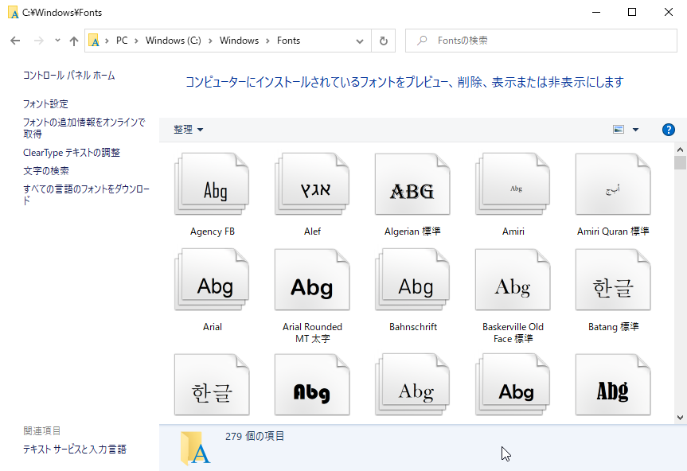

## WordCloudの生成

最後です。単語頻度辞書`{'word1':p1, 'word2':p2, ..., 'wordN':pN}`からワードクラウドを生成するには、`wordcloud`パッケージを利用します。


### とりあえず試そう（最初にやったけどもう1回）

スクリプトは[generate_wc.py](./Codes/short_version/generate_wc.py "INTERNAL")です。コマンドラインからURLを指定して実行すればら、ワードクラウド画像を`img.png`として保存します。

```
C:\temp>python generate_wc.py https://www.cutt.co.jp/

C:\temp>dir img.png
 ドライブ C のボリューム ラベルは Windows です
 ボリューム シリアル番号は 9A6B-34DC です

 C:\temp のディレクトリ

2022/12/03  18:16           415,187 img.png
               1 個のファイル             415,187 バイト
               0 個のディレクトリ  315,416,031,232 バイトの空き領域
```


### パッケージのインポート

利用に際しては、まずパッケージをインポートします。

```Python
>>> import wordcloud
```

### 準備

WordCloudを生成するオブジェクトを[`wordcloud.WordCloud`](https://amueller.github.io/word_cloud/generated/wordcloud.WordCloud.html#wordcloud.WordCloud "LINK")クラスから準備します。

```Python
>>> wc = wordcloud.WordCloud(
...             width=1024,
...             height=768,
...             font_path='/mnt/c/Windows/Fonts/UDDigiKyokashoN-R.ttc'
... )
```

`width`と`height`は生成する画像の横と縦のサイズ（ピクセル数）で、デフォルトでは400×200です。

`font_path`は使用するフォントファイルへのパスです。フォントはOTF（OpenType Font）またはTTF（TrueType Font）でなければなりません。Linuxで実行するときはデフォルトが用意されていますが、その他では明示的に指定しなければなりません。

Windowsでは、`C:\Windows\Fonts`に収容されている、拡張子が`*.ttf`か`*.ttc`（TrueType Collection）のものなら何でも構いません。ただし、単語が日本語ならメイリオやMSゴシックなどの日本語フォントを指定しなければなりません。



他にも多様なオプションがありますが、上記3点あれば問題なく動作します。残りは[マニュアル](https://amueller.github.io/word_cloud/generated/wordcloud.WordCloud.html#wordcloud.WordCloud "LINK")を参照してください。


### 画像のレンダリング

`wordcloud.WordCloud`オブジェクトが用意できたら、その`fit_words()`メソッドに前節で得た単語頻度辞書を引き渡すことで、ワードクラウド画像をレンダリングします。

```
>>> img = wc.fit_words(prob)
```


### ファイルに保存

では、先ほど得た`img`から、ワードクラウド画像をPNGファイルに保存します。ファイルタイプは拡張子から自動的に判定されるので、`to_file()`メソッドにファイル名を指定するだけです。

```Python
>>> img.to_file('img.png')
<wordcloud.wordcloud.WordCloud object at 0x7f166b88c280>
```

これで終わりです。実行したディレクトリにファイルが保存されたので、好みの画像ビューワーで確認してください。


### まとめ

以上をスクリプトファイルにまとめたものは、[generate_wc.py](./Codes/short_version/generate_wc.py "INTERNAL")に収容しました。

コマンドプロンプトから（`main`から）実行するなら、引数にURLを指定します。`main`はこれまでの関数の順に呼び出すことで単語頻度を取得し、ワードクラウド画像を保存します。
