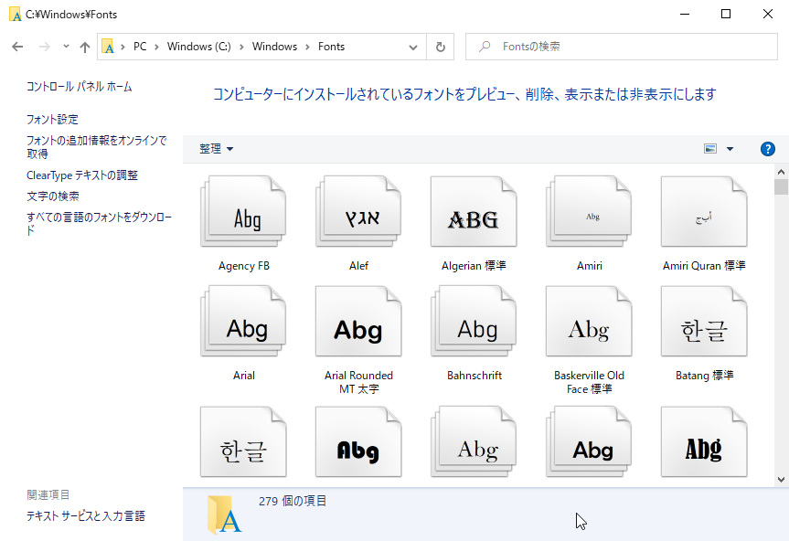

## WordCloudの生成

最後です。単語頻度辞書`{'word1':p1, 'word2':p2, ..., 'wordN':pN}`からワードクラウドを生成するには、`wordcloud`パッケージを利用します。


### パッケージのインポート

利用に際しては、まずパッケージをインポートします。`janome`にはいくつかモジュールがありますが、ここでは分解を司る`tokenizer`モジュールの`Tokenizer`クラスしか用いないので、次のようにインポートします。

```Python
>>> import wordcloud
```

### 準備

WordCloudを生成するオブジェクトを[`wordcloud.WordCloud`](https://amueller.github.io/word_cloud/generated/wordcloud.WordCloud.html#wordcloud.WordCloud "LINK")クラスから準備します。

```Python
>>> wc = wordcloud.WordCloud(
...             width=1024,
...             height=768,
...             font_path='/mnt/c/Windows/Fonts/UDDigiKyokashoN-R.ttc'
... )
```

`width`と`height`は生成する画像の横と縦のサイズ（ピクセル数）で、デフォルトでは400×200です。

`font_path`は使用するフォントファイルへのパスです。フォントはOTF（OpenType Font）またはTTF（TrueType Font）でなければなりません。Linuxで実行するときはデフォルトが用意されていますが、その他では明示的に指定しなければなりません。

Windowsでは、`C:\Windows\Fonts`に収容されている、拡張子が`*.ttf`か`*.ttc`（TrueType Collection）のものなら何でも構いません。ただし、単語が日本語ならメイリオやMSゴシックなどの日本語フォントを指定しなければなりません。



Windows Subsystem for Linux（WSL）でも事情は同じです。Windowsの`C:`ドライブは、Linux上では`/mnt/c/`マウントされているので、あとはそこから`/mnt/c/Windows/Fonts/...`と指定するだけです。なお、WSLでは、対象がWindowsのファイルシステムであっても大文字小文字を区別するので注意してください（たとえば、`/mnt/c/windows/...`は見つかりません。

他にも多様なオプションがありますが、上記3点あれば問題なく動作します。残りは[マニュアル](https://amueller.github.io/word_cloud/generated/wordcloud.WordCloud.html#wordcloud.WordCloud "LINK")を参照してください。


### 画像のレンダリング

`wordcloud.WordCloud`オブジェクトが用意できたら、その`fit_words()`メソッドに前節で得た単語頻度辞書を引き渡すことで、ワードクラウド画像をレンダリングします。

```
>>> img = wc.fit_words(prob)
```


### ファイル名

上記は、PNGファイルとして保存します。その前に、ファイル名を決定しましょう。

ここでは、最初に指定したURLのドメイン名から作成します。このときドメイン名のラベルを区切るドット（`.`）はアンダースコア（`_`）に置換します。たとえば、`https://www.cutt.co.jp/`なら、末尾に`.png`も付けて`www_cutt_co_jp.png`です。

URLを[理解、分解、再構築](https://www.hagaren.jp/ "LINK")するには、標準ライブラリの[`urllib`の`parse`モジュール](https://docs.python.org/ja/3/library/urllib.parse.html "LINK")を用います。ここでは分解だけなので、その中から`urlparse`クラスを用います。インポートは次のように行います。

```Python
>>> from urllib.parse import urlparse
```

URLを分解するには、この`urlparse`クラスの引数にその文字列を指定するだけです。

```Python
>>> urlparse(url)
ParseResult(scheme='https', netloc='www.cutt.co.jp', path='/', params='', query='', fragment='')
```

ドメイン部分は上記から、`netloc`属性から得られます。

```Python
>>> domain = urlparse(url).netloc
>>> domain
'www.cutt.co.jp'
```

あとは、`.`を`_`に置換するだけです。これには[`str.replace()`](https://docs.python.org/ja/3/library/stdtypes.html#string-methods "LINK")メソッドを使います。これに`.png`を加えれば、でき上がりです。

```Python
>>> domain = domain.replace('.', '_') + '.png'
>>> domain
'www_cutt_co_jp.png'
```


### ファイルに保存

では、先ほど得た`img`から、ワードクラウド画像をPNGファイルに保存します。ファイルタイプは拡張子から自動的に判定されるので、`to_file()`メソッドにファイル名を指定するだけです。

```Python
>>> img.to_file(domain)
<wordcloud.wordcloud.WordCloud object at 0x7f166b88c280>
```

これで終わりです。実行したディレクトリにファイルが保存されたので、好みの画像ビューワーで確認してください。


### まとめ

以上をスクリプトファイルにまとめたものは、[generate_wc.py](./Codes/short_version/generate_wc.py "INTERNAL")に収容しました。

コマンドプロンプトから（`main`から）実行するなら、引数にURLを指定します。`main`はこれまでの関数の順に呼び出すことで単語頻度を取得し、ワードクラウド画像を保存します。

```
C:\temp>python generate_wc.py https://www.cutt.co.jp/

C:\temp>dir *.png
 ドライブ J のボリューム ラベルは sat128G3 です
 ボリューム シリアル番号は 0275-2BB8 です

 J:\Cutt2021-Seminars\Materials\Scraping\Codes\short_version のディレクトリ

2022/07/03  15:57           368,073 www_cutt_co_jp.png
               1 個のファイル             368,073 バイト
               0 個のディレクトリ  43,631,509,504 バイトの空き領域
```

