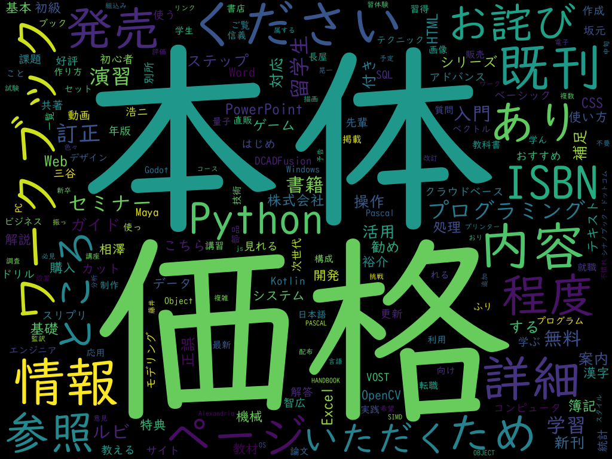

# Webスクレイピング

### 目的

本セミナーでは、[Webスクレイピング](https://ja.wikipedia.org/wiki/ウェブスクレイピング "LINK")とその視覚化を説明します。具体的には、指定のURLのページにある単語を、出現頻度に応じたサイズで散りばめた画像を生成します。

これを[ワードクラウド](https://ja.wikipedia.org/wiki/タグクラウド "LINK")（word cloud）あるいはタグクラウド（tag cloud）と言います。

### 目次

セミナーの時間は90分です。

- [はじめに](./00-Introduction.md "INTERNAL")
- [ページの取得](./01-GetPage.md "INTERNAL")
- [テキストの取得](./02-ExtractTexts.md "INTERNAL")
- [単語への分解](./03-Tokenize.md "ITNERNAL")
- [頻度のカウント](./04-CalcProbs.md "INTERNAL")
- [WordCloudの生成](./05-GenerateWc.md "INTERNAL")

### 使用言語

プログラミングには[Python](https://www.python.org/ "LINK")を用います。また、次の外部パッケージを利用します。

- [requests](https://requests-docs-ja.readthedocs.io/en/latest/ "LINK") - Webアクセス（HTTPクライアント）
- [Beautiful Soup](http://kondou.com/BS4/ "LINK") - HTML解析（パーザー）。現行のバージョン4は*bs4*と呼ばれる。
- [Janome](https://mocobeta.github.io/janome/ "LINK") - 文章解析（形態素解析）
- [WordCloud](http://amueller.github.io/word_cloud/ "LINK") - 単語リストからワードクラウド画像を生成

### 環境

WindowsまたはUnix。UnixについてはWindowsから利用できる[Windows Subsystem for Linux](https://docs.microsoft.com/en-us/windows/wsl/ "LINK")も可です。

スクリプトの実行にはコンソール（Windowsならコマンドプロンプト）を使用します。

オンラインのPython環境（Google Colabや`replit.com`など）でも構いませんが、1）外部パッケージをインストールできる、2）生成した画像を表示できる、あるいはダウンロードできる、ものでなければなりません。

### 受講対象者

Python経験者。

本セミナーで用いるやや凝ったテクニックにリスト内包表記、辞書内包表記、正規表現がありますが、前者2つについてはループの簡易表記、後者についてはパターンによる文字列操作だと思って読み飛ばしてください。

### 参考書籍

本セミナーの内容は、『[Webスクレイピング Pythonによるインターネット情報活用術](https://www.cutt.co.jp/book/978-4-87783-541-5.html)』（2023年8月、280ページ）の第4章で紹介されているのものです。

