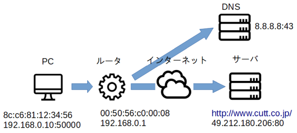

## 2. TCP/IP概要

本章では、TCP/IPインターネットワーキングの基礎をざっとおさらいします。

### どうやってつながるの?

起動したばかりのコンピュータ（PC）がカットシステムのWebサーバ[`http://www.cutt.co.jp`](http://www.cutt.co.jp)にアクセスします。

通信には次の情報が必要です。

- 宛先の**URL**
- ローカルネットワーク上の相手との通信に必須な、自分（PC）と相手（ルータ）の**MACアドレス**
- インターネット上の相手との通信に必須な、自分、ルータ、DNSサーバ、宛先（サーバ）の**IPアドレス**
- コンピュータ上のアプリケーションを区別するために必要な、自分と宛先の**ポート番号**
- アプリケーションがデータ交換をするときに用いるTCP接続に必要な、自分と宛先の**シーケンス番号**

<!-- 600x287 --->

PCは上記を取得するために次のステップを踏みます。

1. 起動したばかりのPCが知っているのは、自分の[ネットワークインタフェースカード](https://www.buffalo.jp/product/detail/lgy-pci-gt.html)に*刻印されている*（シリアル番号のような）MACアドレス`8c:c6:81:12:34:56`だけです。
2. わたしは誰? - [DHCP](https://datatracker.ietf.org/doc/html/rfc2131)\*
	1. DHCPを用いて、自分のIPアドレスを取得します。これには、ローカルネットワークの全デバイスに向けて「わたしは誰?」と叫び、IPアドレスをくれるデバイス（DHCPサーバ）の返事を待ちます。この「全員宛」の宛先IPアドレスには、*あらかじめ定められている*`255.255.255.255`（リミテッドブロードキャスト）を用います。
	2. しかし、`255.255.255.255`はEthernet通信で用いられるMACアドレスではありません。そこで、`255.255.255.255`に対応すると*あらかじめ定められている*Ethernetのブロードキャストアドレス`ff:ff:ff:ff:ff:ff`を使ってアドレス要求を送信します。
	3. DHCPサーバは要求元PCに、1）そのPCのIPアドレス`192.168.0.10`、2）そのPCの最寄りのルータ（デフォルトゲートウェイ）のIPアドレス`192.168.0.1`、3）DNSサーバのアドレス`8.8.8.8`を返信します。PCはまだ自分のIPアドレスを知らないので、上記とおなじようにブロードキャストアドレスを使います。
3. ユーザーがURL`http://www.cutt.co.jp/`を入力しました。
4. 相手は誰? - [DNS](https://datatracker.ietf.org/doc/html/rfc1035)
	1. PCはドメイン名`www.cutt.co.jp`のIPアドレスを知るため、DNSサーバ`8.8.8.8`と話をします。しかし、PCはまだそことどうやって話をしたらよいかまだわかっていません。
	2. しかし、PCは`8.8.8.8`が自分のローカルネットワーク直近のネットワーク内にいないことだけは知っています†。
	3. 知らないよそ様なので、とりあえずルータ`192.168.0.1`にリクエストを送りますが、これはMACアドレスではありません。
	4. アドレス解決 - [ARP](https://datatracker.ietf.org/doc/html/rfc826)
		1. ルータ`192.168.0.1`のMACアドレスを知るため、PCはDHCP同様、`ff:ff:ff:ff:ff:ff`に向けて「`192.168.0.1`はどなたですか」と叫びます。
		2. ルータ`192.168.0.1`が「ぼくは`00:50:56:c0:00:08`」だよ、とPCに返事をくれます。
	5. PCはそこでルータ`00:50:56:c0:00:08`（IPなら`192.168.0.1`）に宛てて、`8.8.8.8`宛ての「`www.cutt.co.jp`のIPアドレスを教えてください」というメッセージを送ります。
	6. ルータ`00:50:56:c0:00:08/192.168.0.1`は`8.8.8.8`に宛てて上記のメッセージを送ります。得られた返事は、そのままPCに返します。
	7. これで、PCは`www.cutt.co.jp`=`49.212.180.206`であることを知りました。ちなみに、これもよそのネットワークにあるマシンなので、以降、通信をするには必ずルータを経由します。
5. コネクションを開く - [TCP](https://datatracker.ietf.org/doc/html/rfc793)
	1. URLの先頭の`http:`から、PCは宛先のポート番号は`80`だと知ります。この`http`=`80`はあらかじめ定められています。
	2. 通信には両端の「アドレス」が必要です。宛先ポートが`80`なのは知っていますが、自分のそれは知りません。そこで、OSに適当に割り振るようにお願いします。たとえば、`50000`を使います。これで、`192.168.0.10:50000`と`49.212.180.206:80`という通信ペアは決まります（アドレスアソシエーション）。
	3. PC`192.168.0.10`はWebサーバー`49.212.180.206`に`TCP SYN`を送ることで、コネクション（通信路）を開くようリクエストします。
	4. Webサーバ`49.212.180.206`はPCに`TCP SYN/ACK`を返送することで、コネクションが用意できたことを知らせます。
	5. PCはサーバに`TCP ACK`を送ることで、コネクションの開設が完了したことを示します。
6. データ送受信 - [HTTP](https://datatracker.ietf.org/doc/html/rfc2616)§
	1. 開設されたコネクションを介して、PCはWebサーバに`GET / HTTP/1.1`のようにどのページが欲しいか伝えます‡。
	2. Webサーバーはページを構成するHTMLテキストデータを返信します。
	3. このとき、WebサーバのOSはデータを1,500バイト単位に分割し、小分けして送ります。ただし、サーバ自身はそのことに頓着しません。分割はOS（TCPスタック）が勝手にやってくれます。
	4. PCは小分けしたデータを受信しますが、こちらでもOSが自律的にそれらを再構成してもとのテキストデータに戻してくれます。
	5. テキストデータがブラウザに引き渡され、そのHTMLがレンダリングされます。

\* 管理者が恒久的なIPアドレスとDNSサーバIPアドレスを設定しているときは、このステップは不要です。  
† ネットマスクをかけたあとの両社のIPアドレスが一致しない。  
§ HTTP/1.1の仕様はもとは[RFC 2616](https://datatracker.ietf.org/doc/html/rfc2616)でしたが（1999年6月）、[RFC 7230](https://datatracker.ietf.org/doc/html/rfc7230)から[RFC 7235](https://datatracker.ietf.org/doc/html/rfc7235)の6部作にアップデートされました（2014年6月）。正式なものは後者ですが、普段使いをするぶんにはコンサイスな前者を参照するとよいでしょう。  
‡ 話を簡単にするため、`Connection: close`ヘッダが加えられているとします。

### OSI参照モデル

参照: [OSI参照モデルとは？TCP/IPとの違いを図解で解説](https://www.itmanage.co.jp/column/osi-reference-model/)

- インターネットを構成する**TCP/IP**は、複数のプロトコル（通信上の決まり事）の組み合わせです。
- 複数の通信プロトコルを組み合わせる方法はいくつも考えられますが、利用するプロトコルを**層状**（layered; 重箱状）に積み重ねる方法が一般的です。
- この層状化の方法を**OSI参照モデル**（OSI Reference Model）といい、7層からなります。「参照」（reference）といわれていることからわかるように、ネットワークを設計するときに参考にするガイドラインです。
- TCP/IPはOSI参照モデルに厳格に従って設計されていないため、利用している（関連付けられている）のはレイヤ2、3、4、7の4層だけです。
- それぞれの層には、その層のプロトコルを制御する専用の機器があります。
- それぞれの層には、その層を利用するメカニズムを識別するアドレスがあります。たとえば、L3のネットワーク層にはIPアドレスがあります。

#### パケット

アプリケーション層を除くTCP/IPの各種のプロトコルはパケットと総称される、最大サイズの決まった搬送単位を用いてデータを交換します。

対義語: 回線交換（参照: [回線交換方式とパケット交換方式](https://seiai.ed.jp/sys/text/csd/cf19/c19a040.html)）。

パケットはヘッダとペイロードの2部構成です。

- ヘッダ（header）: 送信元や宛先などパケットを搬送するために必要な情報を記載。
- ペイロード（payload）: 送るべきメッセージ（データ）。中身はそれを受け取るプロトコルによって異なります。

#### 最大サイズ

パケットに搭載できるデータサイズ（ペイロード）にはそれぞれ上限があります。

- Ethernet: 1,500バイト。これを**MTU**（Maximum Transmission Unit）といいます。1,500バイトなのは信号が長いと途中で壊れやすいなど、電気的な理由から設定されています。昨今のギガビットイーサネットでは[ジャンボフレーム](https://ja.wikipedia.org/wiki/ジャンボフレーム)という9,000バイトまでのものもあります。
- IP: 65,535 - 20 (+オプション) バイト。下位層のMTUより大きなパケットは分割されて別々に送信されます。これをフラグメンテーション（fragmentation）といいます（参考: [第10回　IPパケットの構造とIPフラグメンテーション 3/3](https://atmarkit.itmedia.co.jp/ait/articles/0304/04/news001_3.html)）。フラグメントせずに送信できる安全なサイズは576バイトです（[RFC 791](https://datatracker.ietf.org/doc/html/rfc791)xc参照）。65,535なのはIPヘッダの長さフィールドが16ビットだからです。
- UDP: 65,535 - 8。IPと事情はおなじ。フラグメントが途中で消えると、再送信するメカニズムが備わっていないので、全体が廃棄されます。
- TCP: TCP自体はストリーム志向なので、上限サイズはありません。しかし、セグメントにはあり、デフォルト536バイト（IPの安全サイズ576 - IPヘッダ - TCPヘッダ）です。値はTCPオプションから変更可能です。
- DNS: 512バイト。決してフラグメント化されないIPデータグラム上のUDPデータグラムに収容しなければならないという縛りがあるからです。

> IPv6にはフラグメンテーション化は発生しません。経路MTU探索（Path MTU Discovery）を用いて、エンドツーエンドで許容できる最大のMTU（経路MTU）を検知し、それ以上のデータグラムを送信しないように設計されているからです（[RFC 1981](https://datatracker.ietf.org/doc/html/rfc1981)）。IPv4にも経路MTU探索メカニズムはありますが、あまり使われていません（[RFC 1191](https://datatracker.ietf.org/doc/html/rfc1191)）。

> 通信関係のドキュメントの中にはデータサイズを「バイト」（byte）ではなく、「オクテット」（octet）で記述しているものもありますが、これらはおなじものです。その昔、CPUが一気に処理できるデータの量を「バイト」と呼び、そのビット数はCPUによって異なっていました（たとえば7ビット=1バイトのマシンもあった）。そのため、明示的に8ビットと言いたかった通信関係エンジニアは、あえてオクテット（オクトパスのオクト、つまり8）と呼びました。

#### カプセル化

参照: [データはどうやって伝わるの？](https://atmarkit.itmedia.co.jp/ait/articles/0802/26/news135.html])

それぞれのパケットはは上位から下位へと順次入れ子になっています。これをカプセル化（encapuslation）といいます。

あとで説明するパケットキャプチャツールは、Ethernetレベルのフレームを読み取り、カプセル化された中身を順次ほぐしていくソフトウェアです。

#### 名称一覧

レイヤ | レイヤ名 | TCP/IP | パケットの名称 | 機器の名称 | アドレス
---|---|---|---|---|---
L7 | アプリケーション層 | アプリケーション（HTTPなど）| ストリーム（stream) | [ADC](https://www.trustradius.com/application-delivery-controllers-adc)（Application Delivery Controller）| --　
L4 | トランスポート層| TCP、UDP | セグメント（segment）、データグラム（datagram） | L4スイッチ（L4 switch）| ポート番号
L3 | ネットワーク層| IP | データグラム（datagram） | ルータ（router）| IPアドレス
L2 | データリンク層| Ethernet | フレーム（frame）| ブリッジ（bridge）、スイッチ（switch）| MACアドレス

- 面倒なので、たいていは「パケット」で通してしまいますし、それで問題ありません。たとえば「TCPパケット」。
- 接続機器の名称はどのレイヤのどのパケットを解析するかで決まります（だいたい）。

> もう見なくなりましたが、リピータ（repeater）やリピータハブ（repeater hub）は電気信号を増幅するだけの装置なので、物理層L1に属します。

#### 所属問題

プロトコルによっては、OSIのどこに位置付けるかが必ずしも明確でないものもあります。TCP/IPは必ずしもOSI参照システムに則って設計されているわけではないため、OSIにマッチしないものもあるからです。議論は多数ありますが、完全な答えはありません。
実際に動作するシステムが必ずしもガイドに従っているとは限らないため、答えはありません。

##### ARP

- ARPはEthernetフレームの中に閉じていて、上位層（IP）には伝えられません。したがって、L2と考えられます。
- Ethernetは、EtherTypeと呼ばれる識別子で搬送しているデータを区別できます。たとえばIPv4なら`0x0800`です。EtherTypeにはARPも定義されています。IPとARPが同様に扱われることを考えると、これはL3です。
- MACもIPもどっちも扱うから、L2.5、あるいはL2+L3で手を打ちませんか?

Douglas Comerが『TCP/IPによるネットワーク構築 Vol.1』で「ARPは基板となっているネットワーク物理アドレッシングを隠す下位レベルプロトコルであり……」と述べているので、講師はL2を採用しています。

##### SSL/TLS

- HTTPなどのセッションを管理することからL5と考えられます。
- データの変換や形式を扱うことからL6と考えられます。
- アプリケーションレベルなので、L7と考えられます。

講師はL7派です。
